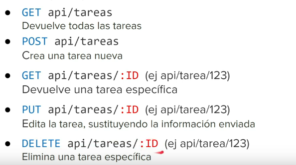
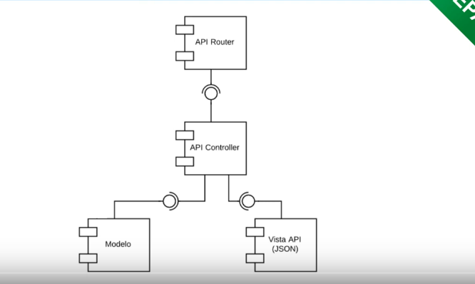
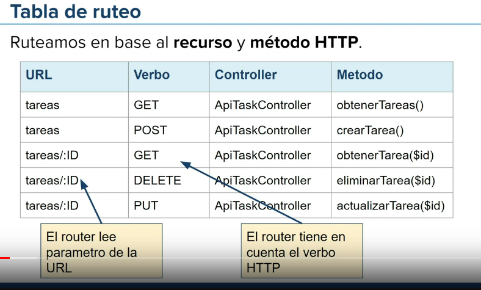

# clase práctica para el resto de los servicios:

> algo importante que se menciono en la clase: debemos diseñar bien nuestros endpoints. Básicamente son las URL que nos permiten acceder a nuestros recursos. Si nos fijamos bien, la misma url por ejemplo `api/tareas` pueden hacer dos cosas distintas según el método. También según los parametros. Este se lo conoce como API RESTful ya que nuestro recurso no cambia.

> Tambien habla de como cambia el patron MVC, que no cambia casi nada, sólo la vista que ahora devuelve JSON en vez de HTML

