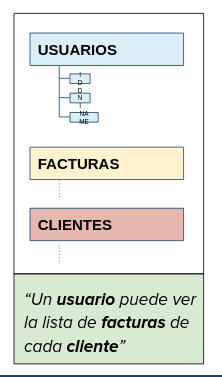

# Slide 1:

## SSR vs CSR - api rest

### SSR - server side rendering

Todos los recursos del sitio o app están alojados o son creados *dentro del servidor*. Cuando un usuario realiza una solicitud, el servidor envía el documento HTML final completo para que el browser lo muestre.

### Client side rendering

En lugar de obtener todo el contenido del documento HTML desde el servidor, se *recibe un HTML básico vacío* y el render ***se completa del lado del cliente*** usando JavaScript.

Toda la lógica, templates, ruteo y obtención de información es manejada en el lado del cliente.
- Usado para hacer SPA.
- Muchos frameworks disponibles.

## csr + ssr 

### enfoque híbrido:

Combina las dos técnicas para lograr una mejor usabilidad desde el punto de vista de la performance y la respuesta al usuario.

Por ejemplo Facebook utiliza este enfoque.

> Las SPA tienen que obtener los datos de algún lugar. ¿De dónde lo hacen?

### ¿Qué son los web-services?

Son ***componentes*** de una aplicación especificos para ***intercambiar informacion*** entre aplicaciones.

Permite la **interoperabilidad** entre distintas plataformas y sistemas por medio de protocolos estandares  y abiertos.

> [nota sobre los web services](https://www.w3.org/TR/2004/NOTE-ws-gloss-20040211/#webservice)

### web services

Actualmente la mayoria de los sistemas utilizan servicios web.

- Los sistemas se empiezan a comunicar entre ellos.
- Comparten información.

> acá hay que notar como uno es consumidor del servicio y otro proveedor

Existen diferentes **protocolos y arquitecturas** de servicios. Los principales son:

- **SOAP** - Simple Object Access Protocol: muy usado en sistemas coorporativos.
- **REST** - Representational State Transfer: muy usado en la internet.

> ... hay más

### API - REST
Se apoya totalmente en el protocolo HTTP. Proporciona una API que utiliza cada uno de los métodos del protocolo.

- Es un tipo de arquitectura más natural y estandar para crear APIs para servicios orientados a internet.
- Una URI representa un **recurso** al que se puede acceder o modificar mediante los métodos del protocolo HTTP (POST, GET, PUT, DELETE).

### API: Aplication Programming Interface

- Es una *interfaz*.
- Permite la utilizacion desde el exterior del sistema.
- Definen datos y cómo acceder a ellos.
- Implementada como:
  - Procedimientos
  - Funciones
  - Objetos y métodos
  - Servicios web

**REST** define un conjunto de principios arquitectonicos por los que se pueden diseñar **Servicios Web** que se centren en los *recursos de un sistema*.

Si la implementacion concreta sigue al menos estos principios básicos de diseño, se lo conoce como **RESTful Web Services**:

- **Interfaz unificada (Recurso + URI + Verbo HTTP)**
> una uri es una cadena de caracteres que identifican los recursos

- **Cliente-servidor**
- **Stateless**

**Recurso**: Cualquier información que se pueda nombrar puede ser un ***recurso***.
> *Usuario*
> 
> Factura
> 
> Cliente

**URI (endpoint)**: Son los puntos de entrada con las que el cliente accede a un recurso.

>http://www.example.com/api/*usuario*
>http://www.example.com/api/*usuario*/5

**Método del recurso**: se utilizan métodos HTTP de manera explicita junto a cada recurso para realizar la transaccion deseada.

> GET
> 
> POST
> 
> PUT
> 
> DELETE

### API REST- respuestas

Cada solicitud a una API REST debe responder con **código de respuesta**.

Inidican el resultado de una solicitud:
- 1xx: Informational
- 2xx: Success
- 3xx: Redirection
- 4xx: Client Error
- 5xx: Server error

#### Ventajas
- Cada servicio puede actualizarse independientemente  mientras respete su interfaz
- Pueden programarse en diferentes lenguajes
- Facilita la reutilización
- Desacopla partes no relacionadas del sistema
- Se pueden usar servicios existentes

#### Desventajas

- Costo de cambiar la especificación de servicios
- Complejidad de cambiar las API y de planificar cambios a futuro

## Protocolo HTTP

Es uno de muchos protocolos de transferencia de datos (FTP, DHCP), se basa en el modelo cliente-servidor. Permite transeferir distintos tipos de recursos:
- HTML
- XML/JSON
- JPEG
- PDF
- ETC.

También es Stateless (las request son independientes).

### Funcionamiento 
Generalmente el cliente solicita datos y el server responde con los datos solicitados. Para que se puedan transferir datos debe existir una **comunicacion** entre el cliente y el servidor:
- El servidor tiene una direccion IP y un puerto dónde escucha por pedidos entrantes
- Cuando el cliente conoce la IP y el puerto puede enviar un request

### Partes de un request
- HTTP method: indica que tipo de operación quiere el cliente.
- Path: especifica la ubicacion de los datos que se necesiten (ejemplo: */horarios/* en la página de exactas)
- Version: especifica que version de HTTP está usando el cliente
- Headers: contiene informacion importante del server (basado en key-values)
- body: algunos tipos de request (ej. *POST*) lleva un payload (ej. datos de un forum)
  

### Métodos http

- GET: recuperación de informacion de un recurso especifico
- HEAD: es similar a un GET excepto que el servido no debe enviar un body en la respuesta
- POST: *crea datos* de un recurso especificado.
- PUT: actualiza datos de un recurso
- DELETE: elimina el recurso especificado
- OPTION: solicitar informacion sobre las opciones de comunicacion disponible para el recurso de destino
- y otros.. PATCH, COPY, LINK, UNLINK, PURGE, LOCK, UNLOCK, etc.

El body suele ser lo más importante, ya que contiene la informacion o datos que el cliente solicito.

Quedan ver los códigos.

1. Informational Responses (100-199)
1. Successful Responses (200-299)
1. Redirection Messages (300-399)
1. Client Error Responses (400-499)
1. Server Error Responses (500-599)

y recomiendan postman, pero el profe tambien habia recomenadado otra que está integrada en el vsCode.