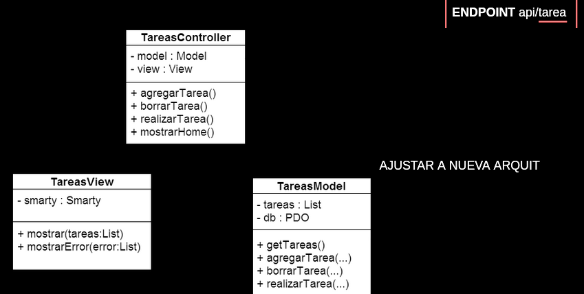

# Slide 2 - api rest

## API REST

Programamos nuestra propia **api rest** para realizar la app de tareas desde un enfoque **C**lient **S**ide **R**endering.
> Es decir, el servidor sólo responde un html muy básico, con referencia a archivos JS. Los datos los obtiene mediante una API, que se los devuelve en formato JSON. Con estos datos, el browser termina de renderizar la página.

#### Qué servicios vamos a tener?

- Mostrar tareas.
- Mostrar tarea.
- Agregar tarea.
- Eliminar tareas.
- Completar Tarea (Editar).

#### Diseñemos los *endopoints*

- GET `api/tareas`
    > Devuelve todas las tareas.
- POST `api/tareas`
    > Crea una nueva tarea.
- GET `api/tareas/:id`(api/tarea/123)
    > Devuelve una tarea especifica.
- PUT `api/tareas/:id`
    > Edita la tarea, sustituyendo la información enviada.
- DELETE `api/tareas/:id`
    > Elimina una tarea específica.

### Arquitectura MVC para REST


> Tenemos un nuevo router, este va a llamar a nuestro controlador definido para la API.

### Tabla de ruteo
Ruteamos en base al **recurso** y **método HTTP**.

| URL       | Verbo    |Controller         | Método               |
|:---------:|:--------:|:-----------------:|:--------------------:|
| tareas    |  GET     | ApiTaskController | obtenerTareas()      |
| tareas    |  POST    | ApiTaskController | crearTarea()         |
|tareas:/id |  GET     | ApiTaskController | obtenerTarea($id)    |
|tareas:/id |  DELETE  | ApiTaskController | eliminarTarea($id)   |
|tareas:/id |  PUT     | ApiTaskController | actualizarTarea($id) |

El ***router*** lee parametros en la URL. También tiene en cuenta el verbo HTTP.

### ¿Qué hay que hacer?

***Router API***:

Diseñar un nuevo router (API ROUTER) para que procese los llamados  a los nuevos servicios.

1. Procesa llamados del tipo "*api/recurso/:params*"
    > Recurso en este caso hace llamada a Tarea
2. Rutea según recurso y verbo

### .htacces
1. Redirigimos la solicitud a router.php

Buena practica: agregamos prefijo **api/** en la URL

```
<IfModule mod_rewrite.c>
RewriteEngine On
RewriteCond %{REQUEST_FILENAME} !-f
RewriteRule ^api/(.*)$ route.php?resource=$1 [QSA,L,END]
</IfModule>
```

### Router 2.0

Podemos usar un router preivamente creado (no es el que veniamos usando, este permite concentrarse en los verbos http) descargandolo y dejandolo en la carpeta *libs*.

[link del router](https://gitlab.com/unicen/Web2/livecoding2024/tandil/todo-list-rest/-/tree/main/libs?ref_type=heads)

```php
<?php
require_once 'libs/router.php';

//crea el router
$router = new Router();


//definimos la tabla de ruteo (seria como el switch)
                  //recurso   verbo  controlador          metodo
$router->addRouter('tareas',  'GET', 'TaskApiController', 'obtenerTareas');
$router->addRouter('tareas',  'POST', 'TaskApiController', 'crearTareas');
$router->addRouter('tareas/:ID','GET', 'TaskApiController', 'obtenerTarea');


?>
```

Las rutas se definen usando el método:

```php
    $router->addRoute($resource: string, $httpMethod: string, $controller: string, $methodController: string);
```

Los **controllers**  obtienen los parámetros del recurso a través de un objeto `$req` que es enviado a los métodos.

> Esto serian los parametros de la url `?hola=asda&edad=1

```php
public function getTarea($req){
    $id = $req->params->id;
    ...
}
```
## API - Obtener tareas (get)

#### TareasApiController

Clase para manejar el recurso `tareas`.

```php
class TaskApiController {
    private $model;
    private $view;

    public function __construct(){
        $this->model = new TareasModel();
        $this->view = new APIView();
    }
    ...
}
```

### APIView

Es una vista común para todos los servicios.
- Maneja el **código de respuesta**
  > 404, 200, 220, etc.  
- Devuelve la informacion en formato JSON.
  > La informacion del modelo

Resultado esperado:

`Reponse Content Type`
`aplication/json`

```json
    [
        {
            "id_tarea": "integer",
            "tarea": "string",
            "realizda": "boolean"
        }
    ]
```

#### implementacion de APIVIEW

- Método response
  - Responsabilidades
    - Setear *header* con el resultado de la operación
    - Encode data en formato JSON
- Método requestStatus
  - Reponsabilidad: dar un mensaje asociado a un código de respuesta

```php
class APIView() {
    
    public function reponse ($data, $status){
        
        header("Content-Type: application/json");
        header("HTTP/1.1" . $status . " " . $this->_requestStatus($satus));

        echo json_encode($data);
        //si no me equivoco esto es lo que muestra cuando hacemos un llamado en postamn

    }
    public function _requestStatus ($code){
        $satus = array(
            200 => "OK",
            404 => "No found",
            500 => "Internal Server Error",
        );

        return (isset($status[$code])) ? $status[$code] : $satus[500];
        //si esta seteado lo devuelvo, sinó devuelvo 500
    }

}

```


#### Ejemplo API tarea



## Tarea GET

La API tiene que permitir traer todas las tareas:

`/api/tareas`


#### TareasAPIController

```php

function get($req){
    $tareas = $this->model->getTareas();
    return $this->view->response($tareas, 200);
}

```

> Podemos probar nuestra API Rest en postamn

### GET tarea


> La api tiene que perimitir traer una tarea:

`/api/tareas/:ID`

#### TareasAPIController

```php

    function get($req){
        if(empty($req->$params->id)){
            $tareas = $this->model->getTareas();
            return $this->view->response($tarea, 200);
        }else{
            $tarea = $this->model->getTarea($req->params->id);
            if(!empty($tarea)){
                return $this->view->response($tarea, 200);
            }//else ??
        }
    }

```

## Lista de tareas

Completamos los servicios que faltan:

- Borrar Tarea
- Agregar Tarea
- Actualizar Tarea
> Agregamos nuevos endopoints

Estos son los nuevos recursos que vamos a tener:

- Borrar tarea (recurso tarea)
  > (DELETE) `api/tareas/:ID`
- Agregar Tarea (recurso tarea)
  > (POST) `api/tareas`
- Actualizar Tarea (recurso tareas)
  > (UPDATE) `api/tareas/:ID`

## Borrandeo un recurso:

> Borrar tareas -> recurso ***tarea***

> (Delete) /api/tareas/:ID

```php
//TaskApiController
public function deleteTask($req){
    $task_id = $req->params->id;
    $task = $this->model->getTask($task_id);

    if($task)
        $this->model->deleteTask($task_id);
        $this->view->response("Tarea id=$tarea_id eliminada con éxito", 200);
    else
        $this->view->response("Task id=$task_id not found.", 404);

}
```
## Creando un recurso (POST)

### ¿Cómo se envian los datos?

> Agregamos tarea (recurso **tareas**)

> verbo: (POST) recurso: api/tareas

Para trabajar con APIs REST, esperamos los datos en formato JSON

Para la estructura del dato, **usamos la misma de salida**:

```json
//así armariamos al dato que queremos ingresar
{
    "titulo": "Tarea API Rest",
    "descripcion": "Una tarea creada desde la API",
    "prioridad": 5
}
```

### Enviado desde POSTMAN

Hacemos un POST y escribimos nuestro objeto JSON en el **body** de la solicitud.


### ¿Cómo recibimos los datos?

1. Leemos el cuerpo del mensaje

```php
    file_get_content("php://input");
    //esta funcion está en el rotuer?
```
***Esto permite la entrada enviada en formato RAW***

Es similar al arreglo $_POST, excepto que:
- No es un arreglo, es un string de los datos crudos
- No importa que verbo se uso (POST, GET, PUT ...)

2. El router obtiene el body y lo deja en el objeto $req

`$req->body` 
> json enviado en el body

### Usando $data

Podemos acceder a los campos

```php
    $req->body->titulo
    $req->body->descripcion
```

```php
    //TaskApiControlelr.php
    public function addTask($req){
        //inserta la tarea
        $titulo = $req->body->titulo;
        $descripcion = $req->body->descripcion;
        $tarea = $this->model->saveTask($titulo, $descripcion);
    }
```

### Modificacion del recurso (PUT)

> Lógica

- Similar al **POST**
- En lugar de **crear** una tarea, vamos a **modificar** una que ya existe.
- Vamos a necesitar al :ID de la tarea a modificar.

> ¿Cuál es la URL que vamos a crear?

> Combina parametros y el acceso al body del request


### Usamdo $data y $params

```php
//TasApiController.php
public function updateTask($req){
    
    $task_id = $req->params->id;
    //el id de api/tareas/:ID
    $task = $this->model->getTask($task_id);

    if($task){
        $titulo = $req->body->titulo;
        $descripcion = $req->body->descripcion;
        $finalizada = $req->body->finalizada;
        $tarea = $this->model->updateTask($task_id, $titulo, $descripcion, $finalizada);
        $this->view->response("Tarea id=$task_id actualizada con éxito", 200);
    }else{
        $this->view->response("Task id=$task_id not found", 404);
    }

}

```


## Otras acciones del dominio

### Parametros GET

`api/tareas?sort=prioridad&order=asc`

Por parámetro GET recibimos el valor de "sort" y "order"
- Devuelve el arreglo de tareas ordenado por prioridad ascendente

`/api/tareas/?pending=true`
- Por parámetro GET recibe el valor de "pending"
- Devuelve el arreglo de tareas que **NO** están finalizadas

### Subrecurso

`api/tarea/1/descripcion`

- Devuelve sólo la descripcion de la tarea