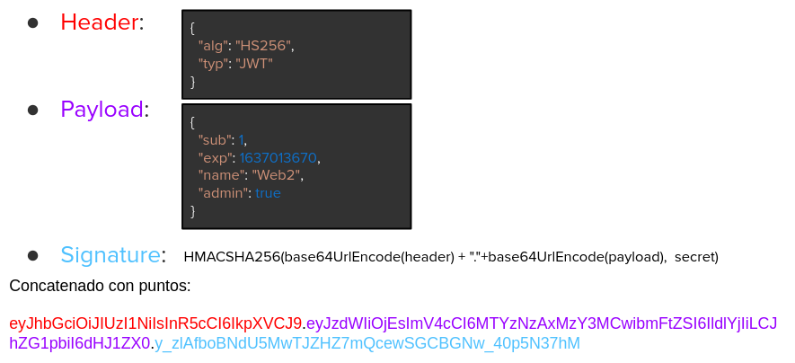
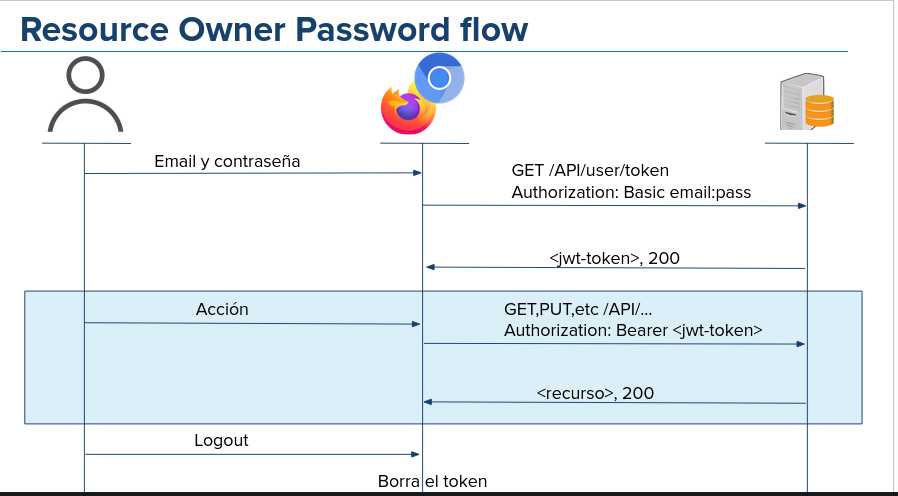

# api Auth

¿Cómo podemos desautorizar a un usuario en nuestra API REST? En cada llamada a nuestra api, el usuario prueba quien es.

### Modos más usados

- Basic
- Bearer
- Digest
- OAuth

### Basic

- Es el más simple y directo
- Agrega un ***header*** con el par **usuario:contraseña** en base 64:
```javascript
    const response = await fetch(`${url}/tareas/${id}`, {
        headers: {
            'Authorization':'Basic d2ViMjoxMjM0NTY=',
            'Content-Type': 'application/json'
        }
    });
```
Vulnerabilidades

- La codificacion base64 es bidireccional
- La constraseña debe estar en memoria para cada peticion
- Si alguien intercepta el mensaje obtiene nuestra conseña

### API Key

- Se genera una clave única por usuario y por servicio
- La clave es un valor al azar
- Funciona como una "llave" para usar el servicio

```javascript

const response = await fetch(`${url}/tareas/${id}`, {
    headers:{
        'Authorization': 'API Key 8d3d0242ac130003',
        'Content-Type': 'application/json'
    }
});

```

Vulnerabilidades:

- La clave debe quedar almacenada entre sesiones.
- Si alguien intercepta el mensaje puede obtener nuestra clave.

### Bearer
- Usa un token provisto por el servidor.
- El token suele ser un String críptico.
- Se puede definir un vencimiento del token.

```javascript
const response = await fetch (`${url}/tareas/${id}`, {
    headers:{
        'Authorization': 'Bearer ${token}',
        'Content-Type': 'application/json'
    }
})
```

Vulnerabilidades:

- Si alguien obtiene nuestro token obtiene permisos temportalmente.

### API Rest - OAuth 2.0
- Usa dos tokens provistos por el servidor
  - Access Token: El que le permite usar el servicio (como el bearen)
  - Refresh token: Permite obtener un nuevo token de acceso (opt)
- Permite que el servidor de autenticación difiera del d servicio.
- Varias formas de autenticacion posibles:
  - Authorization Code Flow
  - implicit flow
  - Resource Owner Password Flow
  - Client Credentials flow

### API rest - JWT

JSON Web tokens:
- JSON codificado en un string
- Entandar RFC 7519
- Permite generar, codificar, y verificar tokens





