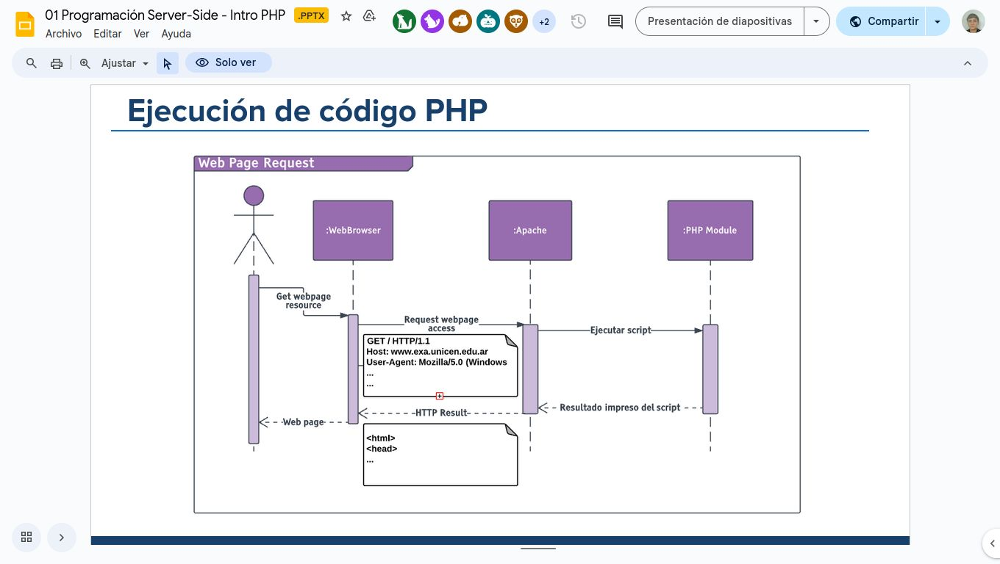
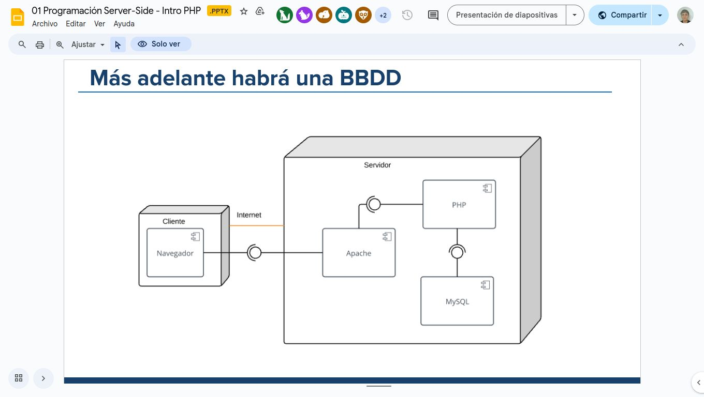
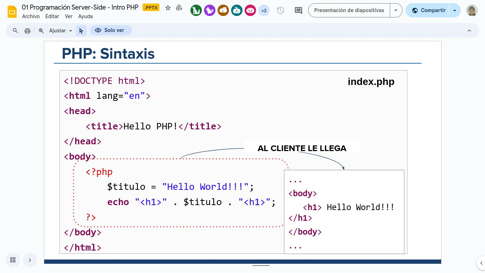
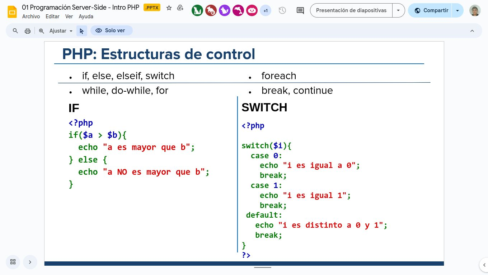
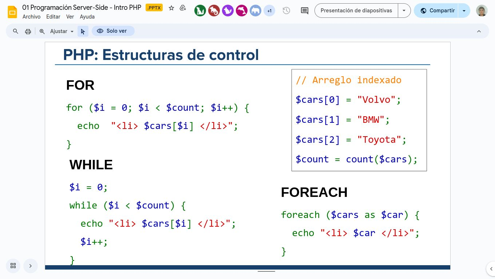
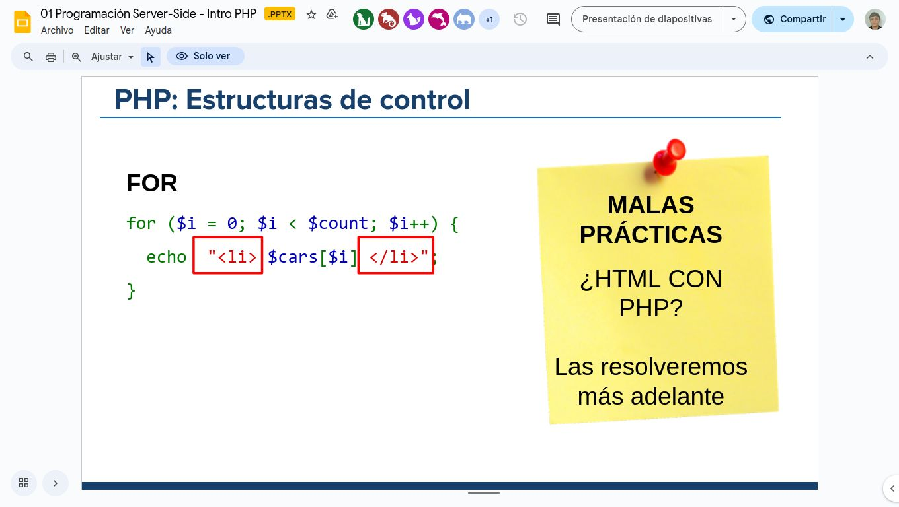

## Intro

### Arquitectura Cliente-Servidor repaso
Las aplicaciones web funcionan sobre un esquema *cliente-servidor*.Que como ya sabemos se basa en la comunicacion entre estos a través de de peticiones y respuestas HTTP.

### Programacion server side:
Esta es el componente principal de los sitios danámicos, dónde un servidor recibe las solicitudes de los clientes para luego procesarlas y devolver una respuesta.

- El cliente recibe HTML/JSON pero no sabe cómo fué producido.
- Requiere un servidor que procese las solicitudes.
- Para procesar las solicitudes se escribe un programa utilizando *algún lenguaje de programación*.


## PHP

- Preprocesador de texto.

- Lenguaje server-side de código abierto.
- adecuado para el desarrollo web y muy utilizado.
- Lenguaje de prçogramación interpretado y orientado a objetos.
- Diseñado para producir sitios y aplicaciones web dinámicas.
- El código es procesado por el intérprete PHP que genera la página web resultante.




### Como empezar:
Creamos una archivo `.php`, este debe incluir los tags de inicio y cierre: `<?php ... >`



*¿Cómo ejecutamos nuestro archivo PHP?*

Tenemos que "servirlo" usando nuestro servidor web:

- XAMPP - Apache usa por default la carpet ***'htdocs'*** para servir archivos: (en windows c:/opt/lampp/htdocs).
- Ponemos los archivos donde el servidor oueda verlos y usamos nuestra dirección local (localhost/127.0.0.1). Apache traduce la ruta relativa de la URL a a estructura de carpetas que tenemos en el servidor.

- Si el archivo es un PHP el módulo de PHP está instalado, Apache ejecuta el script PHP automáticamente
- Lo que genera el script es lo que se envía al naavegador.

Cuando desarrollamos, todos los componentes (tanto el cliente como el servidor) están en nuestra pc.


## PHP: El lenguaje.

Como en cualquier otro lenguaje tenemos la misma estructura de dátos básicas para almacenar información en memoria:

- [Variables](https://www.php.net/manual/es/language.variables.basics.php)
    - Siempren comienzan con $
    - Se definen *implicitamente*: no hay que declararlas.

```php
<?php
    $name = "Juan";
    echo $name; //output Juan
>
```
**Tipos de variables:** Las variables en php son debilmente tipadas: el tipo se define por el contexto en que está siendo usada:

```php
<?php
    $isValid = true;
    $name = "Agus";
    $cont = 12;

    echo "$name edad: $cont";
>
```

- [Constantes](https://www.php.net/manual/es/language.constants.php)
Este valor no varía durante la ejecución del script.
    - Se usa el método `define(nombre, valor)`
    - Para leerlas, usamos el nombre ***sin*** agregar '$'.

```php
<?php
  define("SALUDO", "Hello World.");
  echo SALUDO;  
>
```

- [Arreglos Indexados](https://www.php.net/manual/es/language.types.array.php)
Es un arreglo ordenado en el cual se requiere especificar la posicion en la que se encuentra cada uno de los datos.
```php
<?php
$cars = ["Volvo", "BMW", "Toyota"];

  // Asignación manual
  $cars[0] = "Volvo";
  $cars[1] = "BMW";
  $cars[2] = "Toyota";

  $count = count($cars);  // 3 (int)

>
```
- [Arreglos Asociativos](https://www.php.net/manual/es/language.types.array.php)
A diferencia de los arreglos indexados, los asociativos que tinen claves con nombres especificos

```php
$cars = ["Volvo", "BMW", "Toyota"];

  $edades =  [
    "juan" => 35, 
    "nico" => 17, 
    "julia" => 23 
]
echo $edades["juan"].’</li>’; //imprime 35
echo $edades["julia"].’</li>’; //imprime 23
>
```

[Operaciones con arreglos:](http://php.net/manual/es/ref.array.php)

- insertar un elemento al final
    -array_push($arreglo, $elemento)
    -$arreglo[]=$valor;
- Insertar un elmento al final
    - array_unshift($arreglo, $valor);
- Eliminar el último elemento de un array:
    - array_pop($arreglo)


- [Objetos](https://www.php.net/manual/es/reserved.classes.php)

**stdClass (Clase Estanar)**
- Es una clase predefinida en PHP, que no tiene atributos ni métodos. **<u>Se pueden agrregar atributos cuando querramos**</u>
- Podemos verlo como un JSON en JavaScript

```php
    $user = new stdClass();
    $user->name = "Lucía";
    $user->age = 28;


```

### Estructuras de control:





### Strings:

Concatenacion de cadenas de texto:

- Por operados:
    - `.` -> Concatena Strings
    - `.=` -> Concatena Strings al final

```php
<?php
    $bar = "Mundo";
    $foo = "Hola" . $bar;
    $foo .= "!"; 
    echo $foo;// -> Hola mundo!
>
```
- Por interpolacion:
```php
<?php
    $alguien = 'Agus';
    $donde = 'Aquí';

    echo "$alguien estuvo $donde"; 
>
```


## Ejercicio Diario Digital:
(Esto está en la pŕactica :) )

- Se debe crear un home que liste una grilla de noticias dinámicas.
- Las noticias deben ser leídas de un arreglo asociativo o de objetos
- Debe además tener una sección de “nosotros” (about)


## Funciones
Podemos definir funciones de la siguiente manera:

```php
    <?php
    /*Calcular el promedio de los valores de un arreglo*/

    function promedioEdad($edades){
        $promedio = array_sum($edades) / count($edades);
        return $promedio;
    }
    >
```

[ver más](https://www.php.net/manual/es/functions.user-defined.php)

### Ámbitos:
```php
    $a = 1; /*Ámbito global*/
    function test(){
        echo $a; /*Referencia a una varibale de un ámbito local*/
        //no nos devuelva nada está undefined
    }
    test();
```
Para indicar que vamos a usar una varibale local deberiamos "avisarle" a php con la sentencia `GLOBAL $a`, pero usar estas variables se considera mala pracitca.

## Una webapp muchos archivos

