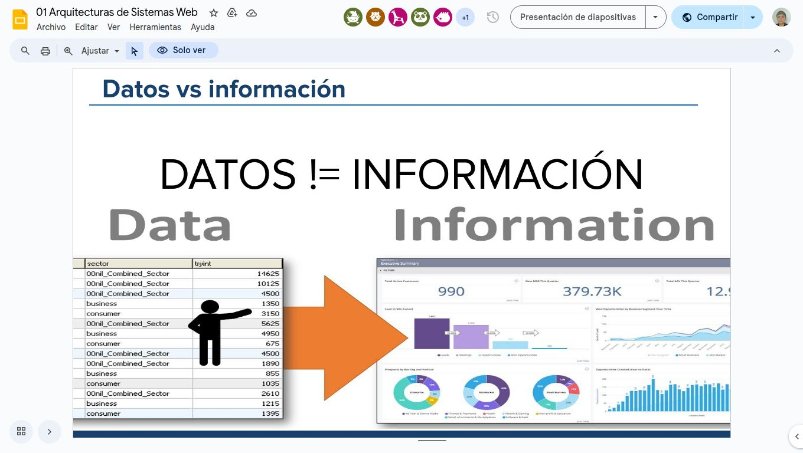
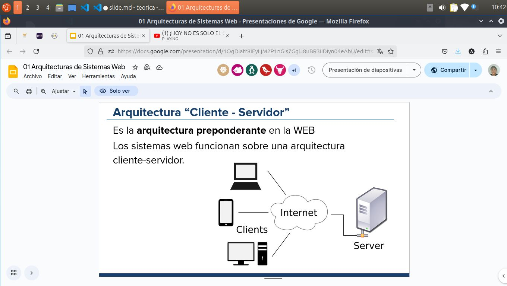
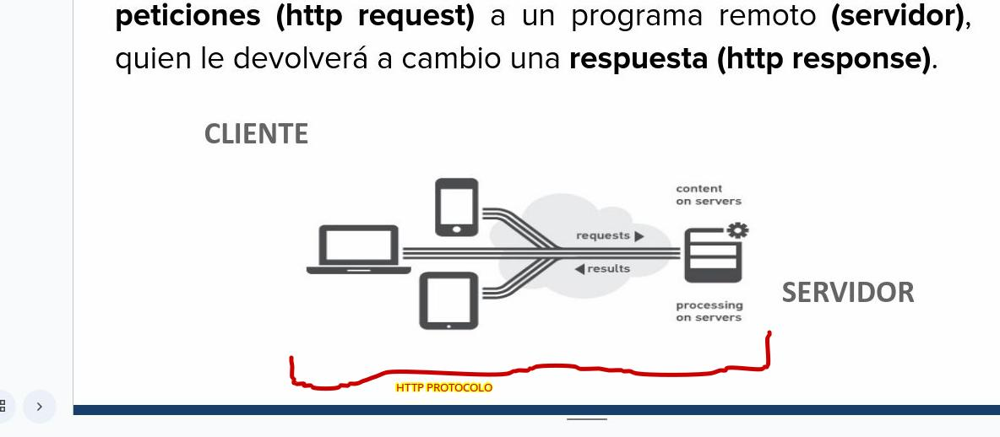
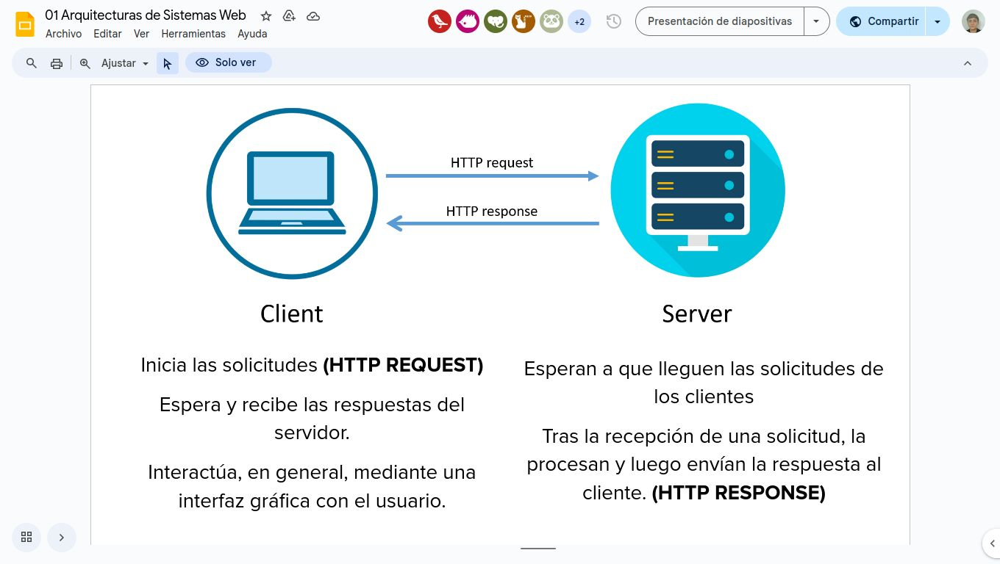
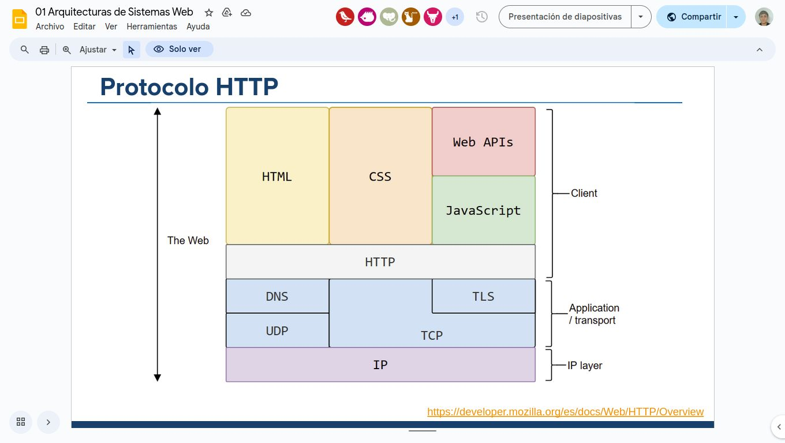
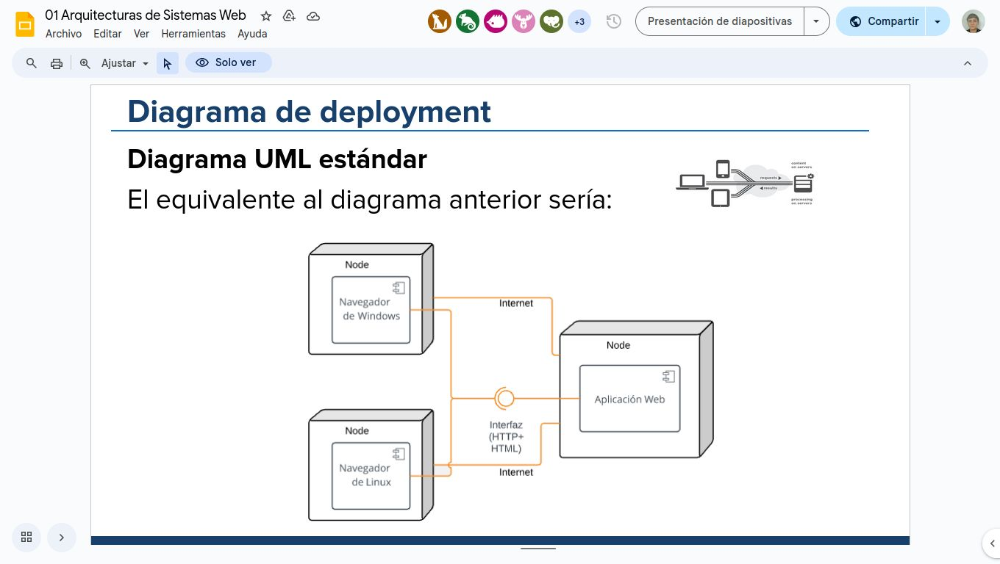
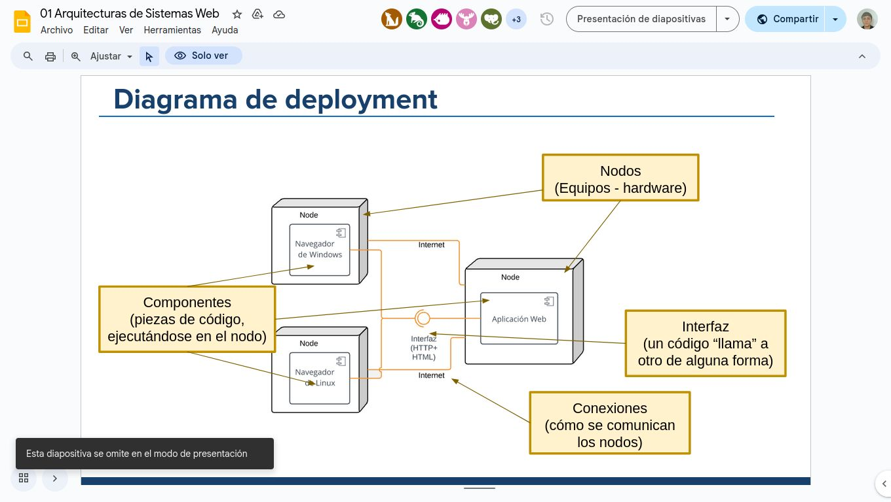
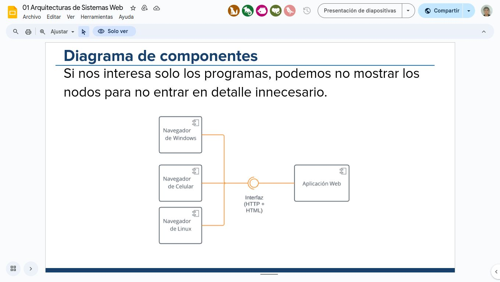
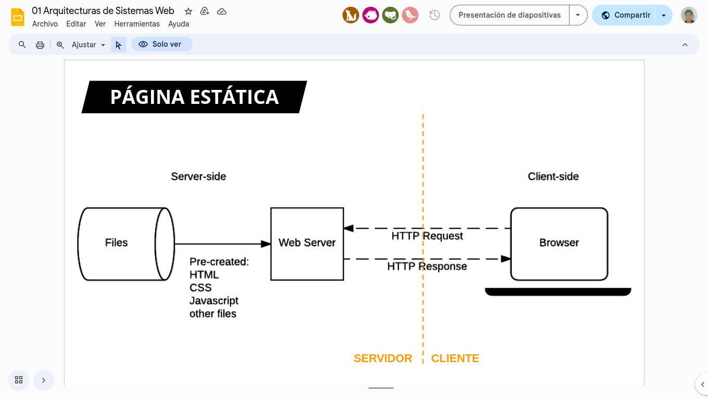
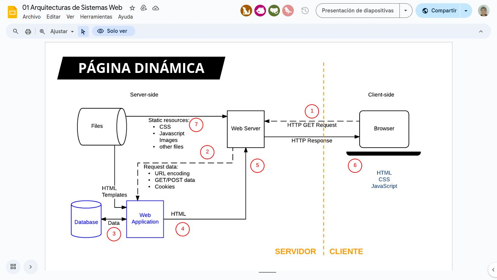

# Clase 1: 

## Sistema de informacion - SI:

Un SI es un *conjunto de elementos digitales orientados al tratamiento y administración de datos e información*, organizados y listos para su uso posterior,generandos para cubrir una necesidad  o un objetivo deuna organizacion o individuo.

### ¿Porqué desarrollamos sistemas?

Se crean *para cubrir una necesidad o un objetivo* de una organización o individuo.

Los sistemas se utilizan para:

- Tomar deciciones.
- controlar operaciones.
- analizar problemas y facilitar actividades
- crear nuevos productos o servicios

### Actividades de un sistema de información:

Existen cuatro actividades en un SI que producen información.
Estas actividades son:
1. **Recompilación**: captura o recolecta los datos.
2. **Almacenamiento**: guarda de forma estructurada la informacion recopilada.
3. **Procesamiento**: convierte esa entrada de datos en una más significativa (información).
4. **Distribución**:transfiere la informacion procesada a las personas o roles que la usarán.

### Datos vs información:

Datos != información

### Sistema WEB:

Un sistema web es un sistema diseñado y desarrollado para que funcione a través de internet.

- Están basados en una arquitectura **cliente-servidor**.
- Utilizan tecnologías WEB para entregar información o servicios a otros usuarios o sistemas.

## Arquitectura cliente servidor:

La arquitectura del Software es el diseño de más alto nivel de la estructura de un sistema. Una **arquitectura** consiste en un conjunto de patrones y abstracciones coherentes que proporciona un marco definido y claro  para interactuar con el código fuente del software.

### Diseño de una Arquitectura:

- La arquitectura le da la estructura a la aplicación

- Permite analizar y diseñar (sin programar) los principales problemas o solucines que podemos tener en nuestra aplicacion

    - No es lo mismo la arquitectura de *WhatsApp* que la de *Dropbox*

- Debe asistir a los servicios/funcionalidad que debe cumplir un sistema (requerimientos funcionales) teniendo en cuenta cuestiones que hacen la operación (requerimientos no funcionales)

### Arquitectura "Cliente - Servidor":
Es la arquitectura preponderante en la WEB. Los sistemas web funcionan sobre una arquitectura cliente-servidor.

En este tipo de interacciones, el usuario (cliente) realiza peticiones (*http request*) a un programa remoto (*servidor*) quien le devolvera a cambio una respuesta (*http response*).

Una arquitectura WEB cuenta con:
- Cliente: **realiza peticiones al servidor**.
- Servidor:administra y responde las peticiones de clientes o de otros servidores.
- Protocolo HTTP: es el protocolo de comunicación entre cliente y servidor (basadao en tcp ip)

<u>Cliente:</u>
- inicia  las solicitudes (HTTP REQUEST)
- Espera y recibe las respuestas del servidor.
- Interectúa, en general, mediante una interfáz gráfica con el usuario.

> HTTP Response: Cliente <------- Servidor
> HTTP Request:  Servidor ---------> Cliente

<u> Server:</u>
- Espera a que lleguen las solicitudes  de los clientes
- Tras la recepción de una solicitud, la procesan y luego envían la respuesta al cliente. (HTTP RESPONSE)

[internet protocols](https://erdeniztunch.medium.com/internet-protocols-ip-dns-http-tcp-ip-and-ssl-tls-ea11bf685499)
[internet security protocol](https://en.wikipedia.org/wiki/DNS_over_TLS)
[Http overview](https://developer.mozilla.org/es/docs/Web/HTTP/Overview)

## Protocolo HTTP

- Define un conjunto pequeño de métodos.
    - GET, POST, etc.

- Tiene un encabezado y un cuerpo
    - (no confundir con html body y header)

- Tiene códigos de estado:
    - Como 404 not found

HTTP es la base del protocolo de la world wide web. Es simple, lo que lo convierte tanto en una limitación y a la vez es un punto fuerte. Mucha gente critica a http por su falta de soporte de estado y su limitada funcionalidad. Pero http se convirtio en estandar mientras que otros protocolos más sostificados jamás alcanzaron su potencial.

## Diagrama de deployment

### **Diagrama UML estandar**:
El equivalente al diagrama anterior seria:

### Diagrama de componentes:
Si sólo nos interesan los programas, podemos no mostrar los nodos para no entrar en detalles inncesarios:

## Entrega de una página web:

¿Cómo accedemos a una página web a través de una arquitectura web cliente servidor?

### Web Server:
El web server permite a http acceder a un sitio web.

### ¿Qué hace un servidor web?

Hoy en día, la mayoria de los servidores web permiten que en cada peticion se *ejecute un programa que genera dinamicamente* el recurso que se envía al usuario (server-side scripting).
- el contenido dinámico se genera con la informacion de una base de datos por ejemplo
- procesan informacion que les llega del mismo (autenticacion, formulario,  upload archivos)

Esta funcionalidad permite el dessarollo de sistemas web completos

### Apache
- lanzado en 1995
- código libre
- implementado en c
- [link](https://github.com/apache/httpd)

Esta discusión actualmente se ve en los sitios WEB. Existen dos formas de hacerlo
Server Side Rendering: El servidor envía el HTML completo o parcial del sitio
Client Side Rendering: El servidor envía datos (JSON, XML) y el cliente los procesa y renderiza el HTML en la página

Existen casos híbridos, donde se baja el HTML completo inicialmente (procesado en el servidor) pero luego se actualiza mediante AJAX. 

La demo esta en la clase 0 presencial :) 

[recursos](https://bedfordcollegegroup.ac.uk/subjects/computing-it/)
[recursos 2](https://www.oreilly.com/library/view/web-application-architecture/9780470518601/)

[Generalidades HTTP:](https://developer.mozilla.org/es/docs/Web/HTTP/Overview)
"Hypertext Transfer Protocol" es el nombre de un protocolo el cual nos permite realizar una peticion de datos y recursos, como pueden ser documentos Html. Es la base de cualquier intercambio de datos en la web, y un protocolo de estructura cliente-servidor, esto quiere decir que una peticion de datos es iniciada por el elemento que recibira el cliente, normalmente un navegador web. Así una página web completa es el resultado de la union de desintos sub-documentos recibidos, como por ejemplo: un documento que especifique el estilo de maquetación de la pagina web,el texto, ls imagenes, los scripts, etc. 
Clientes y servidores se comunican intercambiando mensajes individuales. Los mensajes que envia el cliente, se llaman peticiones,y los enviados por el servidor se llaman respuestas.

HTTP es un protocolo ampiabale que ha ido evolucionando  con el tiempo. Es lo que se conoce como un protocolo de la capa de aplicacion, y se transmite sobre el protocolo TCP o el protocolo encriptado TLS. Al ser ampiable, no se utiliza sólo para el envio de documentos de hipertexto, sino que además se usa para transmitir imagenes o videos, enviar datos o contenido a los servidores como en el caso de los formularios HTTP. Tambien puede usarse para encviar partes de documentos y actualizar  páginas en el acto.

## Arquitectura de los sistemas basados en HTTP 
Http es un protocolo basado en el principio cliente servidor: las peticiones son enviadas por una entidad: el agente del usuario (o un proxy). La mayoria de las veces el agente de un usuario es un navegador web pero podría ser cualquier otro programa. 

Cada peticion individual se envía a un servidor, el cuál gestiona y responde. Entre cada peticion y respuesta hay varios intermediarios denominados *proxies*. Los cuales realizan distintas funciones como: *gateaways*, o *caches*. 

En realidad hay muchos más intermediarios, como routers, modems... pero gracias a la arquitectura en capas de la web que estos son transparentes tanto al navegador como al servidor, ya que http se apoya en los protiocolos de red y transporte. HTTP es un protocolo de aplicacion y por tanto se apoya sobre los anteriores. Aunque para diagnosticar problmas en redes de comunicacion  las capas inferiores son irrelevanted para la definicion del protocolo HTTP. 

### Clinte: el agente del usuario 

El agente del usuario es cualquier herramienta que actue en representacion del usuario. Esta funcion es realizada en la mayor parte de los casos por un navegador web. hay excepciones, como en el caso de programas especificamente usados por desarrolladores para desarrollar y depurar sus aplicaciones. 

El navegador es quien inicia una comunicacion. Para poder mostrar una pagina web, el navegador envía una petición de documento HTML al servidor. Entonves procesa este documento y envía más peticiones para solicitar scripts, hojas de estilo, y otros datos que necesite. El navegador une estos documentos y datos y compoene el resultado final. Los scripts los ejecuta también el navegador y también pueden generar más peticiones de datos en el tiempo y el navegador gestionará y actualizara la pagina web en consecuencia. 

### el servidor web 
Al otro lado del canal de comunicacion está el servidor el cual "sirve" los datosque ha pedido el cliente Un servidor conceptualmente es una unica entidad aunque puede estar formado por varios elementos que se reparten la carga de peticiones, u otros programas, que gestionan otros computadores y que generan parte o todo el documento que ha sido pedido. 

Un servidor no tiene que ser necesariamente un único equipo fisico, aunque puede estar funcionando en un único computador. En el estandar HTTP/1.1 y Host pueden compartir la misma direccion IP. 

### Proxies: 
Entre el cliente y e servidor existen ademas distintos dispoditivos que gestionan los mensjaes HTTP. Dada la arquitectura en capas, la mayoria de estos dispositvos solamente gestionan estos mensajes en los niveles de protocolo inferiores: capa de transporte, capa de red o fisica, siendo asi transparentes para la capa de comunicaciones de aplicacion del HTTP, además esto aumenta el rendimiento de la comunicacion. Aquellos dispositivos que sí operan procesando la capa de aplicación son conocifos como proxies. Estos pueden ser transparentes, o no y realizan varias funciones: 

- caching (la caché puede ser pública o privada)
- filtrado (como un anti-virus, control parental,...)
- balanceo de carga de peticiones (permite que varios servidores responder a la carga total de peticiones que reciben)
- autenticación (para el control al acceso de recursos y datos)
- registro de eventos (para tener un historico de lso eventos que se producen)

## Caracteristicas clave del Protocolo HTTP

