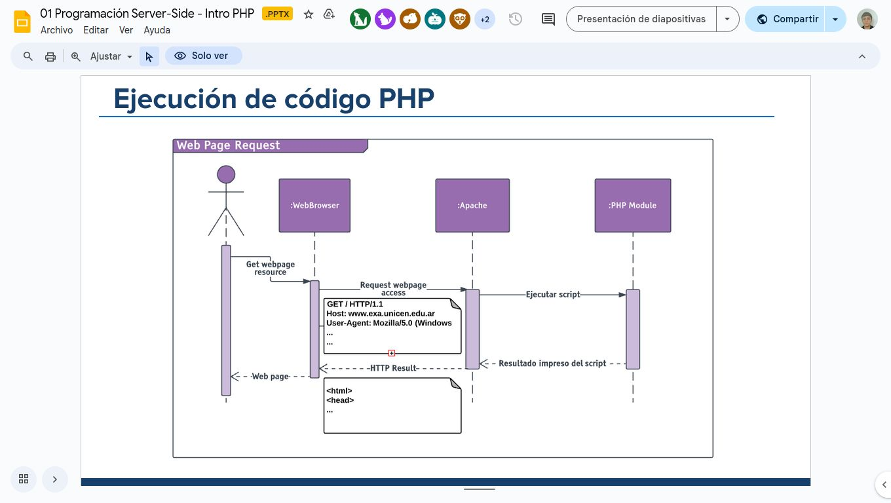
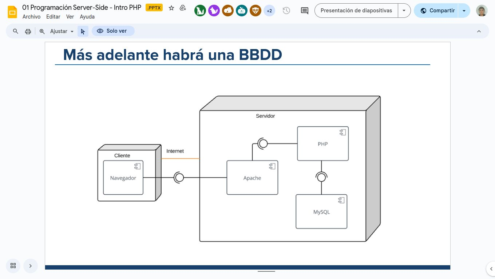
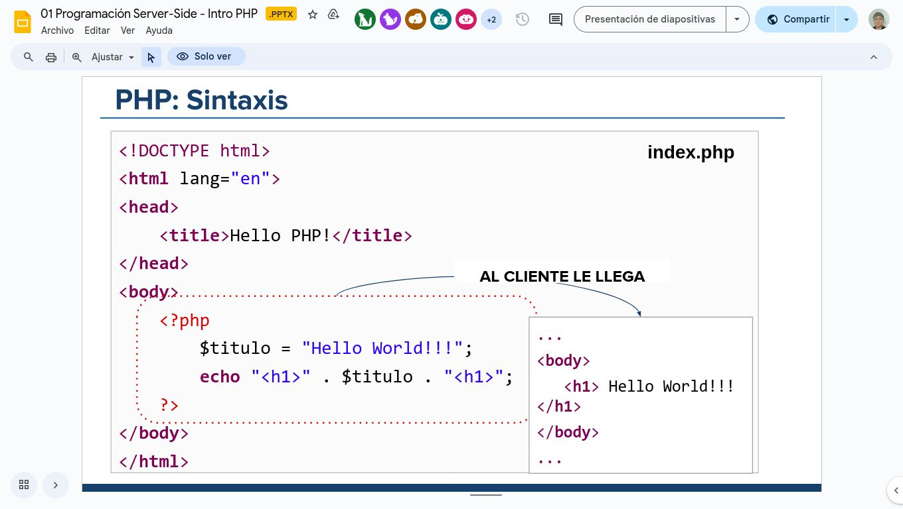
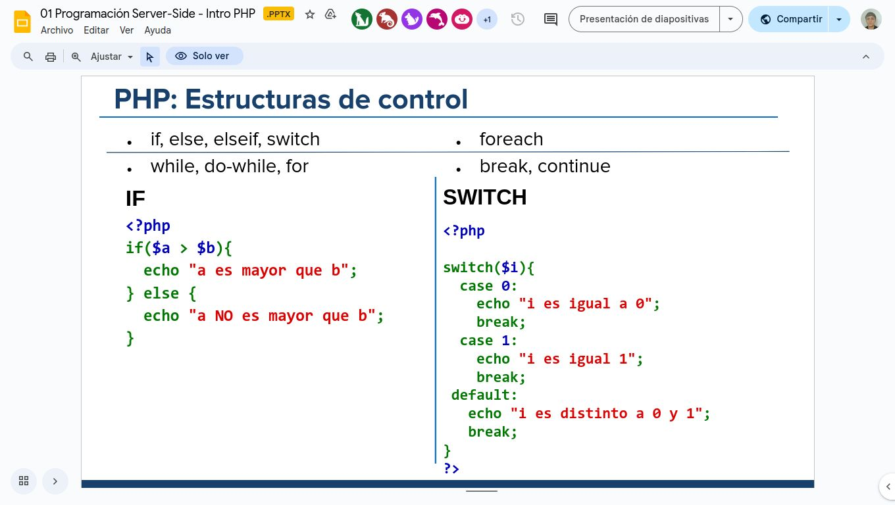
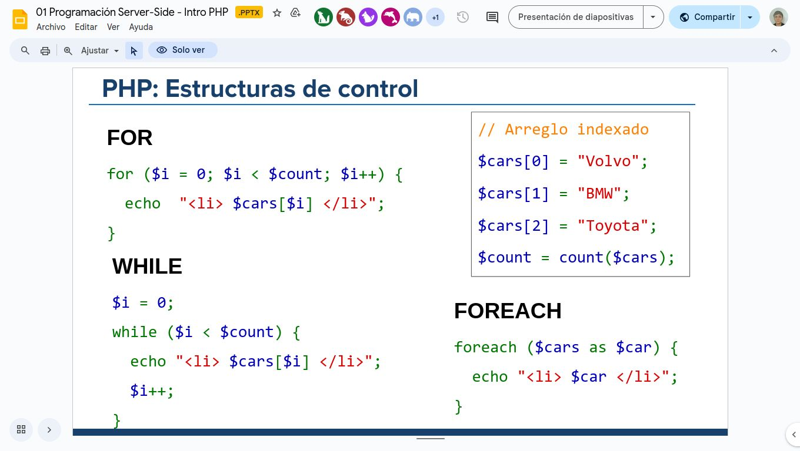
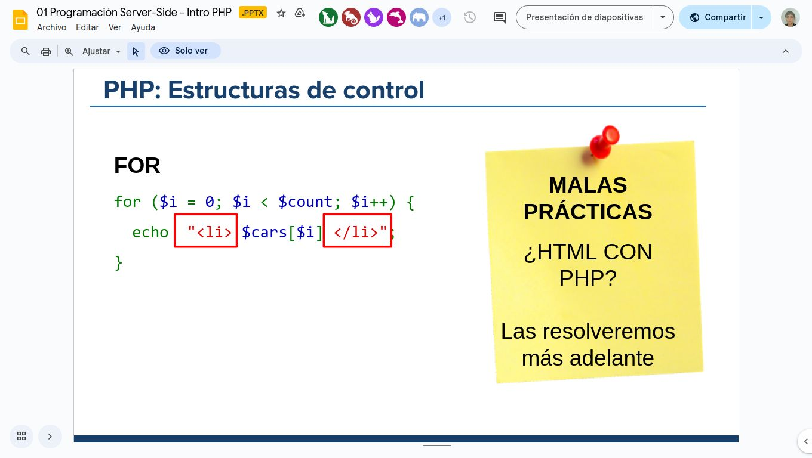

## Intro

### Arquitectura Cliente-Servidor repaso
Las aplicaciones web funcionan sobre un esquema *cliente-servidor*.Que como ya sabemos se basa en la comunicacion entre estos a través de de peticiones y respuestas HTTP.

### Programacion server side:
Esta es el componente principal de los sitios danámicos, dónde un servidor recibe las solicitudes de los clientes para luego procesarlas y devolver una respuesta.

- El cliente recibe HTML/JSON pero no sabe cómo fué producido.
- Requiere un servidor que procese las solicitudes.
- Para procesar las solicitudes se escribe un programa utilizando *algún lenguaje de programación*.


## PHP

- Preprocesador de texto.

- Lenguaje server-side de código abierto.
- adecuado para el desarrollo web y muy utilizado.
- Lenguaje de prçogramación interpretado y orientado a objetos.
- Diseñado para producir sitios y aplicaciones web dinámicas.
- El código es procesado por el intérprete PHP que genera la página web resultante.




### Como empezar:
Creamos una archivo `.php`, este debe incluir los tags de inicio y cierre: `<?php ... >`



*¿Cómo ejecutamos nuestro archivo PHP?*

Tenemos que "servirlo" usando nuestro servidor web:

- XAMPP - Apache usa por default la carpet ***'htdocs'*** para servir archivos: (en windows c:/opt/lampp/htdocs).
- Ponemos los archivos donde el servidor oueda verlos y usamos nuestra dirección local (localhost/127.0.0.1). Apache traduce la ruta relativa de la URL a a estructura de carpetas que tenemos en el servidor.

- Si el archivo es un PHP el módulo de PHP está instalado, Apache ejecuta el script PHP automáticamente
- Lo que genera el script es lo que se envía al naavegador.

Cuando desarrollamos, todos los componentes (tanto el cliente como el servidor) están en nuestra pc.


## PHP: El lenguaje.

Como en cualquier otro lenguaje tenemos la misma estructura de dátos básicas para almacenar información en memoria:

- [Variables](https://www.php.net/manual/es/language.variables.basics.php)
    - Siempren comienzan con $
    - Se definen *implicitamente*: no hay que declararlas.

```php
<?php
    $name = "Juan";
    echo $name; //output Juan
>
```
**Tipos de variables:** Las variables en php son debilmente tipadas: el tipo se define por el contexto en que está siendo usada:

```php
<?php
    $isValid = true;
    $name = "Agus";
    $cont = 12;

    echo "$name edad: $cont";
>
```

- [Constantes](https://www.php.net/manual/es/language.constants.php)
Este valor no varía durante la ejecución del script.
    - Se usa el método `define(nombre, valor)`
    - Para leerlas, usamos el nombre ***sin*** agregar '$'.

```php
<?php
  define("SALUDO", "Hello World.");
  echo SALUDO;  
>
```

- [Arreglos Indexados](https://www.php.net/manual/es/language.types.array.php)
Es un arreglo ordenado en el cual se requiere especificar la posicion en la que se encuentra cada uno de los datos.
```php
<?php
$cars = ["Volvo", "BMW", "Toyota"];

  // Asignación manual
  $cars[0] = "Volvo";
  $cars[1] = "BMW";
  $cars[2] = "Toyota";

  $count = count($cars);  // 3 (int)

>
```
- [Arreglos Asociativos](https://www.php.net/manual/es/language.types.array.php)
A diferencia de los arreglos indexados, los asociativos que tinen claves con nombres especificos

```php
$cars = ["Volvo", "BMW", "Toyota"];

  $edades =  [
    "juan" => 35, 
    "nico" => 17, 
    "julia" => 23 
]
echo $edades["juan"].’</li>’; //imprime 35
echo $edades["julia"].’</li>’; //imprime 23
>
```

[Operaciones con arreglos:](http://php.net/manual/es/ref.array.php)

- insertar un elemento al final
    -array_push($arreglo, $elemento)
    -$arreglo[]=$valor;
- Insertar un elmento al final
    - array_unshift($arreglo, $valor);
- Eliminar el último elemento de un array:
    - array_pop($arreglo)


- [Objetos](https://www.php.net/manual/es/reserved.classes.php)

**stdClass (Clase Estanar)**
- Es una clase predefinida en PHP, que no tiene atributos ni métodos. **<u>Se pueden agrregar atributos cuando querramos**</u>
- Podemos verlo como un JSON en JavaScript

```php
    $user = new stdClass();
    $user->name = "Lucía";
    $user->age = 28;


```

### Estructuras de control:



## Una app web: Muchos archivos:

***Index.php*** es el script php que apache elige ejecutar por defecto (cuando entramos a una de las carpetas en htdocs, si hay un index este se va a ejecutar)

- Si se quiere ejecutar otro archivo desde el browser, cada uno tiene su propia url (es relativo al index)
- Los archivos pueden incluirse entre si para organizar el código.

### include
`include 'flineame.php'`
Incluye el archivo especificado. Todas las funciones y variables definidas en el archivo pueden ser accedidas por qui9en lo incluye. 
```php
//localidades.php
<?php
$prov = 'BA';
$ciudad = 'Azul'
>

```
```php
//test.php
include 'localidades.php';
echo "Origen: $ciudad $prov";
```
Podriamos decir que es como conectar un archivo con otro.

### require

Cumple una función parecida a include, pero en este caso, si algo falla detiene al script php y lanza un error fatal de nivel `E_COMPILE_ERROR`, a diferencia del **warning** que arroja *include*. Algunas de las posibles causas de este error podrian ser que el archivo no existe o no es accesible.

### require_once
Esta es identica a require, sólo que PHP verificara si el archivo ya fue incluido y si es así no se incluye de nuevo. (También existe include_once).

Um ejemplo puede ser que `index.php` requiera a dos archivos, *musica.php* y *personas.php*, y a su vez estos dos archivos requien a un mismo archivo *settings.php*. 

## Enviar datos desde un cliente al servidor

Uno de los mecanismos más naturales para enviar datos al servidor es con formularios ***HTML***.
- Son uno de los principales puntos de interaccion entre un usuario y un sitio web o app
- Permite que los usuarios introduzcan datos que generalmente se envian a un servidor web para su procesamiento y almacenamiento.

### Partes de un formulario web:
- El atributo action define la ubicación (URL) donde se envían los datos del formulario.
- El atributo *METHOD* define con qué método http se envían los datos (generalmente get o post)
- Debe haber al menos un elemnto del tipo "submit"
- El atributo name identificará en el lado a los datos ingresados por el usuario en el control. Se envia siempre un par clave/valor por cada elmento. 
(el name de un input funciona como una variable cuando llega al servidor)

### Métodos HTTP
Dos de los métodos más utilizados para enviar informacion al sevidor son:

- GET: `<form method=GET>`<br>
Este método envía la información codificada del usuario en *HTTP request* directamente en la url:<br>
`localhost/login.php?`***variable1=valor1***`&variable2=valor2&...`

- POST: `<form method=GET>`<br>
Este método tambíen codifica la informacion, pero en este caso se envía a través del BODY del HTTPREQUEST, por lo que no aparece en la url.

### Variables $_GET y $_POST

Para poder acceder a estos valores enviados desde el cliente, en PHP existen los arreglos asociativos que se utilizan para recuperar la informacion enviada al servidor:

- $_GET: Se usa para recuperar datos enviados por la url
- $_POST: Se usa para recuperar los datos del body

### Ejemplo GEt

```php
<hmtl>
    <form action="ejemploget.php" method="get">
        <input type="text" name="nombre" />
        <input type="text" name="edad" />
        <input type="submit"> 
    </form>
</html>
```

```php
<?php
    if(isset($_GET['nombre'])){
        $usuario = $_GET['nombre'];
        $edad = $_GET['edad'];

        echo "<p>Usuario: " . $usuario . "</p>";
        echo "<p>Edad: " . $edad . "</p>"; 
    }
>

```
Si vemos las url del archivo por cada metodo, se verian algo asi: 

- get: `http://localhost/web2/edad.php?usuario=juan`
- post: `http://localhost/web2/datos.php`


### Request:
Request sirve para cuando esperamos parametros por ambos métodos, ya que contiene el contenido de ambas variables anteriores (los arreglos asociativos $_GET y $_POST en $_REQUEST)


```php
<?php
if(isset($_REQUEST['nombre'])){ 
    $nombre = $_REQUEST['nombre']; 
    echo "Nombre: " . $nombre . "<br/>"; 
} 
?>

```

Podemos utilizar el método GET para armar urls dinamicas, **esta manera se conoce como query strings <u> y se pueden hacer sin formularios</u>**. 
- `<a href="profile.php?`*id=20"*`>John Doe</a>`
- `<a href="products.php?page=2">`


## Formularios con AJAX
Se usaria para enviar el formulario al servidor sin recargar toda la página:

- 1 : Asignamos un event handler al formulario:
- 2 : Usamos un formData para compilar los datos en pares clave/valor y lo enviamos mediante XMLHttpRequest (fetch)

> Dentro de la función “handler” hace referencia al formulario. CUIDADO, si usamos arrow function “this” no es el formulario.

`const data = new URLSearchParams(new FormData(this));`

- 3: Enviamos la informacion con fetch():
```javascript
document.querySelector("#formulario").addEventListener('submit', function(e){
    e.preventDefault();
    const data = new URLSearchParams(new FormData(this));//this estaria haciendo referencia al formulario que desencadena el evento, por eso creamos un formdata

    fetch('ejemplo.php', {//Podriamos usar this.action y this.method
        method: 'post',
        body: data,
    })
    .then(response => response.text())
    .then(html=>{
        document.querySelector('#container').innerHtml = html;
        //html seria el response anterioir
    })
    .catch(error => console.log(error));
});
```

### Debbuguear en el servidor: 

- Usar echo
Para variables simples
echo "Valor de la variable var: $var";
- Usar var_dump:
Para variables complejas como arreglos, objetos, etc
var_dump($var);