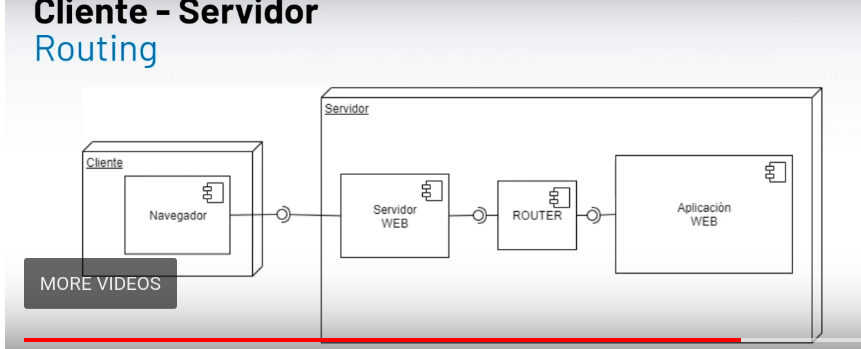

Hasta ahora, cada vez que el usuario queria realizar alguna *accion* sobre nuestro *sistema* lo hacía mediante una *peticion http* a través de una url que mapeaba directamente a un archivo php. De esta manera, por cada accion había un archivo fisico.

Esto puede hacer que la aplicacion crezca demasiado en cantidad de archivos, en el ejemplo de calculadora, por ejemplo, una accion como puede ser *suma* debía estar en un archivo, pero para simplificar ya agregar funcionalidad, agregamos el archivo `operaciones.php` que según el parametro que le pasemos realiza una accion u otra. Pero aunque sea mejor, sigue existiendo una correlacion entre una url y un archivo php.

Una de las opciones más utilizadaas para resolver este problema es el *ruteo*. Es una manera de *configurar la aplicacion* para que acepte urls que no necesariamente mapeen a un archivo fisico.

Este ruter funciona de una manera relativamente sencilla, este definea algo llamado ***tabla de ruteo***, que asocia una *url de un método http* con una *acción o parte del sistema en especifico*.

|      URL                |    MËTODO  |      ACCION                   |
|:-----------------------:|:----------:|:-----------------------------:|
|localhost/sumar/a/b      |     GET    |operacion.php::sumar(a,b)      |
|localhost/multiplicar/a/b|     GET    |operacion.php::multiplicar(a,b)|
|localhost/about          |    GET     |about.php                      |
|localhost/login          | POST       | login.php                     |

Por  cada url disponible el router invoca a un archivo, o a un método de ese archivo. Dicho de una manera más simple el router es un untermediario que se encarga de entender que accion está solicitando el usuario, ver con que parametros fue invovadao la accion y llamar a quien corresponda.

Esta tabla es un concepto. Luego la implemetnamos según el lenguaje y demás cuestiones. Lo interesante acá es tener en cuenta que esta tabla está  estrechamente relacionada con la navegacion del usuairo. Es decir de cierta manera la primer columna define las acciones que los usuarios pueden realizar en nuestro sistema.

Desde el punto de vista arquitectonico, nos queda el siguiente diagrama:

Tecnicamente estaria dentro del servidor web