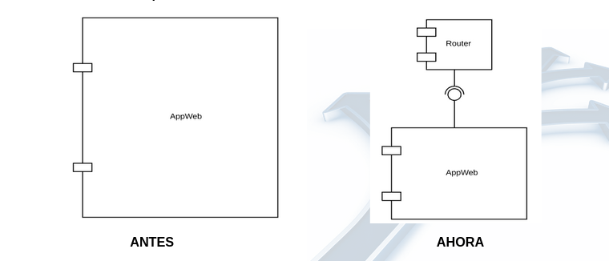

# Ruteo
En el ejemplo del [diario diagital](https://gitlab.com/unicen/Web2/livecoding2022/tandil/diario-digital) las url se veian de la siguiente manera:

`localhost/index.php`

`localhost/noticias.php?id=1`

`localhost/about.php?dev=juan`

Este tipo de urls conllevan a dos problemas: 1) Por cada seccion o accion nueva requiere que *cree un nuevo archivo php*. 2) Las url no se entienden, lo que es malo para SEO y posicionamiento de la página.

## Url's semánticas (amigables, pretty urls)
Estas urls son aquellas que son amigables para el usuario.
- Mal:  `http://www.exa.unicen.edu.ar/index.php?hl=es&p=ingresantes` 
- Bien: `http://www.exa.unicen.edu.ar/es/ingresantes`


#### Ventajas:
- Faciles de enteder para los usuarios
- Mejorar el posicionamiento y el SEO
- Proporcionan informacion sobre la estructura del seo
- Fáciles de *compartir* por wssp, llamada, divulgacion, etc.
- Más esteticas

Veamos este ejemplo aplicado a un usuario de twitter:
> https://twitter.com/starwars

#### Ejemplo
Queremos modificar nuestra app de diario para que acepte URL's semánticas, y pasen a ser algo así:

- http://localhost/index.php => http://localhost/home
- http://localhost/noticia.php?id=1 => http://localhost/noticia/1
- http://localhost/about.php?dev=juan => http://localhost/about/juan

En un sistema real, no podemos tener un archivo PHP para todas las acciones y combinaciones posibles que el usuario quiera ejecutar, por lo tanto es necesario enrutar la aplicacion.

## Routing
Es el mecánismo por el cual cada <u>**solicitud del usuario**</u> (*compuesta por una URL y método HTTP*) es dirigida a una <u>***componente de código*** encargado de antenderlas</u>.

- Se encarga de determinar el PATH a donde queremos redireccionarnos.
- Implica romper la lógica de "cada URL es un archivo".

### Tabla de ruteo

Esta define las rutas de nuestro sistema:

| Accion(url)                 |       url                     |
|:---------------------------:|:-----------------------------:|
| /home                       |showHome();                    |
| /about                      |showAbout();                   |
| /about/:dev                 |showAbout(:dev);               |
| /noticia/:id                |showNoticia(:id);              |

Necesitamos un componente principal que atienda TODOS los request.



Creamos un archivo llamado `router.php` que ***encapsula*** el comportamiento del *componente ruteador*.

Este comportamiento es el siguiente: lee una ***acción*** y una lista de **parámetros** -> :**action**/[:*a*/:*b*].

-> Recibe la siguiente url: .../route.php?**action**=*noticia*/*1*.


### route.php

```php
 <?php
require_once 'noticias.php';
require_once 'about.php';

//creamos una accion por defecto, cuando inicia la página o no hay niguna accion requerida por el usuario
$action = 'home';

//Ahora vemos si hay alguna accion definida, de ser así reemplazamos la que está por defecto
if (!empty($_GET['action'])){
    $action = $_GET['action'];
    //Básicamente, estamos viendo si hay algún request get con el parametro "action" definido
}
    $params = explode('/', $action);
    //Parseamos la accion, por si esta tiene más parametros
    //ejemplo: route.php?action=about/agus

//Y ahora según la accion hacemos algo:
switch($params[0]){
     case 'home':
        showHome();
        break;
    case 'noticia':
        showNoticia($params[1]);
        break;
    case 'about':
        $id = null;
        if (isset($params[1])) $id = $params[1];
        showAbout($id);
        break;
    default:
        echo('404 Page not found');
        break;

}
 >
```
## Reescribiendo rutas

En este punto, ya tenemos el ruteo, que es quien recibe todas las urls y peticiendo de hecho y se encarga de tomar decisiones. Pero justamente por esto las urls siguen siendo casi iguales que al principio:
- /route.php?action=about/juan
- /route.php?action=noticia/1

Ahora buscamos hacerlas más amigables. Para esto usamos las reglas apache.

#### Reglas apache
Usamos <u>reglas del servidor</u> (que en sí dependen del servidor, en este caso es apache) para "*enmascarar*" la url *y no mostrar* el archivo `router.php` *en la url*.

Esto lo especigicamos en el archivo ***.htacces***. Indicamos que queremos que todo lo que sea una url o una peticion http vaya a nuestro archivo enrutador.


### .htacces
Es un ***archivo de configuración de apache HTPP web server. Nos permite configurar opciones *a nivel de directorio*.

**<u>Apps</u>**:
- Prevenir hotlinking
- Bloquear usuarios por IP
- Documentos de error
- Redirigir durante mantenimiento
- Ocultar listado del directorio
- Ruteo


Este archivo *va en la carpeta base* o la de *URL base* a rutear. El archivo se veria algo así:

```apache
<IfModule mod_rewrite.c>
	RewriteEngine On
    RewriteCond %{REQUEST_FILENAME} -f [OR]
    RewriteCond %{REQUEST_FILENAME} -d


    RewriteRule \.(?:css|js|jpe?g|gif|png)$ - [L]
</IfModule>

```


Ahora si podemos cambiar nuestras viejas urls por las nuevas.


#### Urls y datos estáticos
Si queremos entrar a `www.diariotudai.com/about/juan` no nos muestra la imagen.
- Este entra en `route.php?action=about/juan`
- El problema es que está intentando encontrar la imagen en `/about/images/juan.jpg` y lo estamos buscando desde un template html, que está en la carpeta /template. Por lo que desde ahí no conoce la ruta hasta el archivo, que puede estar en /about/images/juan.jpg

El problema se origina en que ya no sabe reconocer esa ruta porque primero debemos pasar por route.php.
En el código de clases del diario todavía no hay un about. Pero si está el base tag, ya que hay un template html.
#### Tag base

***Tag Base < base >***
En lugar de usar rutas absolutas, usamos el tag *base*, que va dentro del **head**.
- Nos indica cuál es la base de nuestro sitio. Ej:`www.diariodigital.com`
- En nuestro caso seria algo como: `http://localhost/calculadora/`
  
```html
  <head>
<base href="http://localhost/diariodigital/" >
<!--Esto se considera una mala práctica porue funciona sólo en nuestra computadora-->
```

Debemos saber la base de nuestro sitio web, dada por nuestro servidor. Esto se lo podemos pedir a php con la variable del server `$_SERVER`.

Para crear la base de nuestro sitio:
```php
define('BASE_URL', '//'.$_SERVER['SERVER_NAME'] . ':' . $_SERVER['SERVER_PORT'] . dirname($_SERVER['PHP_SELF']).'/');

```
Y dentro del head de html:

```html
<base href="'.BASE_URL.'">
```

- SERVER_NAME: Nombre del server (localhost)
- SERVER_PORT: Nro puerto server (por default no se vé)
- PHP_SELF: El script que se está ejecutando.
- dirname(): Nos devuelve el directorio del script que le pasemos por parametro.


Quedan dos páginas y lo que es un ruteo bónito digamos