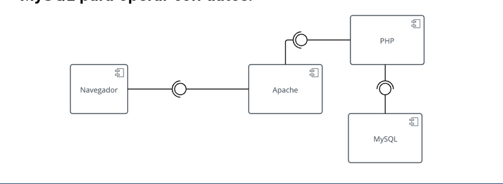
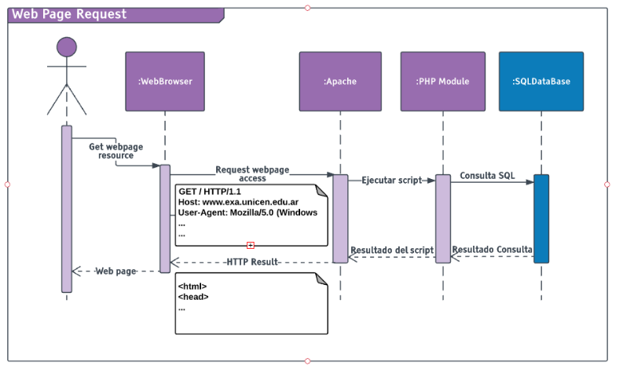
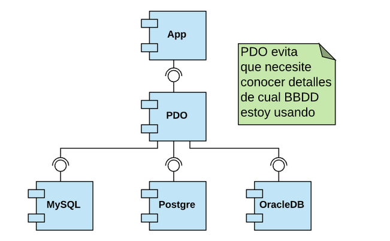
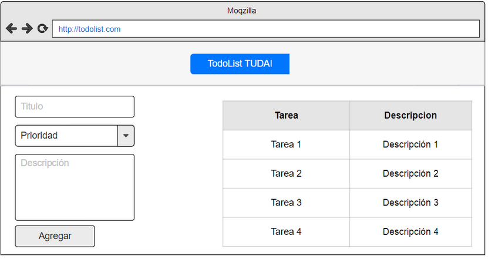
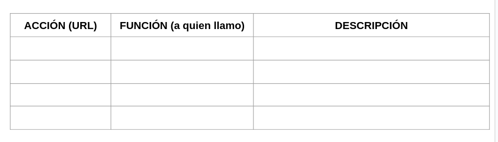
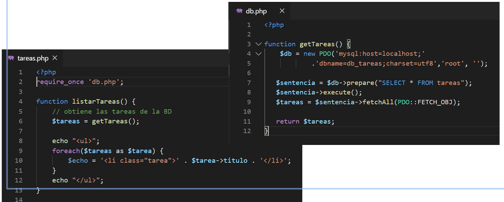

## ¿Cómo nos conectamos desde php con mysql para operar con datos?

El motor de la base de datos, *en el servidor* <q>**es un servicio independiente**</q>. El módulo PHP se va a conectar con mysql para operar con datos.




#### El módulo php interactúa con el módulo mysql



> Acá se puede ver claramente como tanto php como mysql son "servicios" independientes, pero a su vez se puden comunicar. Según parece ambas cosas conviven en el servidor, tanto apache y php como el gestor.

Cada lenguaje tiene un conector a la base de datos. Usamos funciones específicas para conectarnos. En resumen, estos son los pasos habituales para conectarnos desde nuestro código:

1. **Abrimos** una *conexión*.
2. **Ejecutamos** la consulta.
3. **Obtenemos** los datos (para generar el HTML)
4. **Cerramos** la conexión.

- 1)
  
```php
    $link = mysqli_connect($host, $user, $passwd, $db);
```

- 2)

```php
    $result = mysqli_query($link, 'SELECT * WHERE 1=1');
```

- 3)

```php
    $arreglo = mysqli_fetch_all($result, MYSQLI_ASSOC);
    foreach($arreglo as $value){
        echo $value['campo'];
    }

```

- 4) 

```php
    mysqli_close($link);
```

#### ¿Qué pasa si un cliente decide cambiar de base de datos?

- Habíamos creado la aplicación para que funcione con MySQL,
- Las bases de datos tienen pequeñas diferencias en el código SQL que entienden (algunas no tan pequeñas).
- Vamos a tener que revisar nuestro código y reescribir cada consulta.

## PHP Data Object (PDO)
**D**ata **A**cces **A**bstraction **L**ayer hace que escribamos una vez el código y funcione para cualquie base de datos. Funciona como un ***Intermediario*** entre la *lógica* y los *datos* de nuestra aplicacion.



- Es una herramienta de acceso a base de datos. (Interface)
- Funciona con PHP 5.1 y superiores.
- PDO es cómpilado, es decír más rápido.
- soporta a la mayoria de db conocidas:
    -mysql
    -sqlite
    -mssql
    -etc

Cada controlador de base de datos que implemente la interfaz PDO puede exponer características especificas de la base de datos.

Para saber si tenemos *PDO* instalado, podemos crear un archivo php y ejecutar la función phpinfo(). Lo abrimos con el explorador y busamos las lienas PDO y pdo_mysql. Si estas ya están entonces podemos trabajar con PDO y MySQL.

### Ejemplo obtener tareas con PDO:
```php
#1) abrimos la conexión
$db = new PDO('mysql:host=localhost;dbname=test_db;charset=utf8', 'root', '');

# 2) ejecutamos la consulta
$sentence = $db->prepare("select * from tarea");
$sentence->execute();
# 3) obtenemos los datos para generar un html
$tareas = $sentence->fetchAll(PDO::FETCJ_OBJ);
foreach($tareas as $tarea){
    echo $tarea->nombre;
}
# 4) Con PDO no es necesario cerrar la conexión

```

## Ejemplo, lista de tareas - aplicación web usando base de datos:

#### Ejemplo todolist app
Vamos a construir una aplicación que nos permita administrar una lista de tareas. (con persistencia en un BD)

#### Requerimientos funcionales:
- Un *usuario* puede **ver** su lista de tareas.
- un usuario puede **agregar** tareas a su lista.
- un usuario puede **eliminar** tareas de su lista.
- un usuario puede **marcar** como completada una tarea.

#### Así se va a ver al home de nuestra app:

#### Tabla de ruteo:


#### ¿Como va a estar conformada cada tarea?

- Titulo
- descripción
- prioridad (1 a 5)
- finalizada (booleano)

Vamos a contruir la app paso a paso en 3 iteraciones:

1. Listar tareas
2. Crear tareas
3. Eliminar/finalizar tareas

## Primera iteracion:

- Creamos la base de datos.
- Creamos el proyecto.
- Listamos las tareas.

### ¿De dónde sacamos los datos?

Vamos a crear una tabla y obtener los datos desde ella. esta tabla debe contar con los siguentes atributos: *id_tarea*, *titulo*, *descripcion*, *prioridad*, *finalizada*.

- id_tarea: es nuestra clave primaria. Por lo tanto es también autoincremental.

Ahora queremos obtener todas las tareas con una consulta SQL.

`SELECT * FROM tareas`

##### ¿Cómo hacemos esta consulta desde PHP?

Lo hacemos siguiendo los pasos ya detallados para conectarnos con la DB a través de PDO: empezamos creando una nueva conexión.

- Servidor: *localhost*.
- Base de datos: *web2_test*.
- Usuario: *root*.
- Contraseña: *root* (en xampp suele ser vacía igualmente)
```php
$db = new PDO('mysql:host=localhost'.'db_name=web2_test;charset=utf8', 'root', '');
```

#### getTareas() - SELECT

- `prepare($sqlQuery)`

    permite la creación de una sentencia para su posterior uso:

```php
    $sentencia = $db->prepare("SELECT * FROM tareas");
```
- `execute($array)`

    Ejecuta la sentencia que previamente habíamos preparado, el parametro arreglo es opcional, o puede no tener nada, o bien debe ser un arreglo con la cantida de elemento que necesitemos. Espera, en caso de no estar vacío, ***si o si un arreglo***.
```php
    $sentencia->execute();
```

- fetch()

    Itera sobre la *tuplas* seleccionadas. (estructura de datos ligera que tiene un número específico y una secuencia de valores)

```php
    while($fila = $sentencia->fetch(PDO::FETCH_OBJ)){
        echo '<li>' . $fila->titulo . ': '. $fila->descripcion.'.'. '</li>';
    }

    # Esto igualmente se considera mala practica, ya que estamos mezclando PHP y HTML
    # Conviene separar a el código que nos devuelva un arreglo. Así la obtención de datos es independiente y no importa si viene de una BBDD, archivo u otra fuente
```


- fetchAll()

    Devuelve un array con las tuplas seleccionadas:
    


#### Resumen fetch:
- PDO::FETCH_ASSOC: devuelve un array asociativo por los nombres de las columnas del conjunto de resultados.
- PDO::FETCH_OBJ: devuelve un objeto anónimo con nombres de propiedades que se corresponden a los nombres de las columnas devueltas en el conjunto de resultados.
- PDO::FETCH_BOTH: devuelve un array indexado tanto por nombre de columna, como numéricamente.
- PDO::FETCH_NUM: devuelve un array indexado por el número de columna tal como fue devuelto en el conjunto de resultados, comenzando por la columna 0.


## Segunda Iteración - Insertar tareas:

Para hacerlo de una manera segura, preveniendo inyeciones SQL (ver pag. 40 a 42) hacemos:

- prepare($sqlQuery)

    Permite la creacion de una sentencia "parametrizada" para su posterior uso:

```php
    $sentencia = $db->prepare("INSERT INTO tareas(titulo) VALUES (?)");
```

- execute($array)

    ejecuta la sentencia con los parámetros:

```php
    $sentencia->execute(array('Hacer la página de Web'));
    $sentencia->execute(array('estudiar otra materias'));
```
### Paso de parametros:

- El paso de parámetros le permite a PDO controlar y escapar las variables con contenido inseguro:
  
```php
    $sentencia->execute("tareas'; DROP TABLE tareas; SELECT'");
```
- PDO escapará los caracteres problemáticos y el texto será insertado normalmente.

### Agregar tarea, último ID

- Podríamos hacer que agregarTarea() ***devuelva el último ID***, para eso:
```php
$db->lastinsertId();
```
- Nos devuelve el  ***id*** del último elemento insertado. 
### Parametro por nombre 
- Los paremotros también pueden ser pasados de forma asociativa:
```php
    $sentencia = $this->db->prepare(
        "INSERT INTO tareas(titulo, descripcion)"
        . "VALUES(:titulo, :descripcion)";
    )

    $sentencia->execute(array(
        ":titulo" => $tarea['titulo'],
        ":descripcion" =>   $tarea['descripcion']
    ));
```

Una vez que una tarea es insertada, podemos *redireccionar devuelta a nuestra home*:
```php
// Redirect browser
header("Location: /home"); 
```
## 3era iteracion:
Ejecutar una query que borra una tarea por ID:

```php
    $sentencia = $db->prepare(
        "DELETE FROM tareas WHERE id=?";
    );

    $sentencia->execute([$id_tarea]);

```

### Finalizar una tarea (UPDATE):

- tenemos que agregar la pposibilidad de marcar una tarea como realizada.
- En caso de estar completa se debe mostrar la lista pero tachada.
```php
    $sentencia = $db->prepare(
    "UPDATE tareas SET Finalizada=1"
    ." WHERE id_tarea=?"
    );

$sentencia->execute([$id_tarea]);

```

[REPO](https://gitlab.com/unicen/Web2/livecoding2020/tandil/tasks/-/commit/b6cd0b42539b9de72d85de5d67090e84bf15ad03)

Sigue con un ejemplo.


[todolist I](https://drive.google.com/drive/u/0/folders/1QFnXT6M8frvGePTxKK-qpIqohlNMvTlV)


[mvc I - intro a POO](https://drive.google.com/drive/u/0/folders/1QFnXT6M8frvGePTxKK-qpIqohlNMvTlV)
[mvc](https://drive.google.com/drive/u/0/folders/1QFnXT6M8frvGePTxKK-qpIqohlNMvTlV) 
[mvc tp](https://drive.google.com/drive/u/0/folders/1QFnXT6M8frvGePTxKK-qpIqohlNMvTlV)

[autenticacion de usuario I](https://drive.google.com/file/d/16y42geZU1bGgi_3LE1WLD3kk5DYnjZqW/view?usp=drive_link)