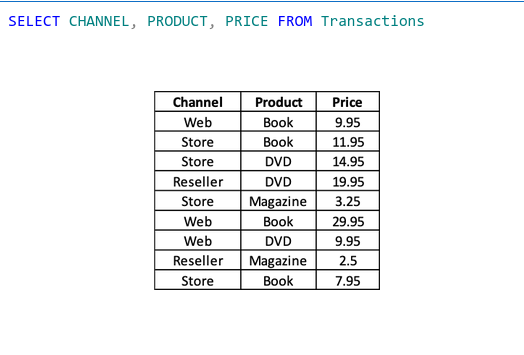

## Persintencia
Es la acción de ***preservar la información*** de forma permanente y a su vez ***recuperar*** la misma para que pueda ser nuevamente utlizada.

Tenemos mecanismos para hacer persistencias, ya sea con archivos *binarios/textos* o *JSON/XML*. Se almacenan en *base de datos*, tanto estructuradas como no-estructuradas.


>Las bases de datos pueden almacenar información en varios formatos de archivo dependiendo del sistema de gestión de bases de datos (DBMS) que se utilice. Algunos formatos comunes incluyen:
>- .db o .sqlite: Usados por SQLite.
>- .mdf y .ldf: Utilizados por Microsoft SQL Server (archivos de datos y de registro).
>- .frm, .ibd: Usados por MySQL y MariaDB (para almacenar definiciones de tablas y datos InnoDB).
>- .dbf: Utilizado por dBase, FoxPro, y otros sistemas.
>- .ndb: Utilizado por Clustrix y MySQL Cluster.


Sobre los datos podemos realizar determinadas operaciones. 

- **A**ltas.
- **B**ajas.
- **M**odificaciones o actualizanes.
- **C**onsultas.

>(Por sus sigles en ingles: CRUD)

## Modelar datos de un sistema:
Los datos representan parte de un problema. Cada sistema tendrá diferentes datos a ser usados, aunque muchas veces sean similares.

Ejemplos:

- Sitema de reservas tipo AirBnB.
    - Usuarios.
    - Propiedades.
    - Locatorio.
    - Reserva.
- Sistema de Alquiler de Autos.
    - Usuarios.
    - Vehiculos.
    - Empresa.
    - Alquiler.

### Ejemplo de un caso:
Pensemos en un sistema tipo UBER para Tandíl. Este debe permitir (*requerimientos funcionales*):
- Que los usuarios puedan registrarse.
- Que los usuarios pidan hacer un viaje de un origen a un destino.
- Que los usuarios puedan eligir entre una lista de los conductores disponibles.

### Modelado de datos:
Las etapas para representar la información en el mundo computacional:

1) *Identifación de los datos*: acores, recursos, objetos, y cualquier cosa del mundo real del cuál nos interesa gurdar informacion.
2) *Identificación de relaciones entre datos*: detección de los vínculos significativos que se dan entre los elementos.
3) *Abstracción de los datos y relaciones*: Representación simbólica de los elmentos detectados.

> Los *requerimientos funcionales nos dan pistas de las principales **entidades** a persistir.

En el ejemplo Uber podemos encontrar: `usuarios`, `viaje`, `origen`, `destino` y `conductores` por ejemplo.

## Modelando los datos:

> Que los usuarios puedan registrarse:

Podemos usar los siguientes *atributos* para *representar* a un usuario en mi sistema:
- nombre.
- edad.
- ciudad.

Para poder distinguir entre usuarios, van a necesitar un identificador único:

- id.

Cada tabla debe tener una *clave primaria*, que es una columna o conjunto de columnas que definen una *fila* única de la tabla.

### Datos:
Un dato es el "estado" que toma un atributo.

- Se llama **CAMPO** a cada atributo de la tabla. Por ejemplo: nombre y edad son campos.
- Se llama **REGISTRO** al conjunto de campos que definen un elemento de la tabla.

filas = regitros (*Un registro de atributos y estado*)

columnas = atributos/campos

### Tipos de datos:
Enteros, flotantes, textos, caracteres, fecha, booleano, bit, y más...

- INT: 4 bytes (2^32)
- TINYINT: 1 byte (2^8)
- BIGINT: 8 bytes (2^64)
- DATE: 3 bytes
- TEXT: longitud + 2 bytes


## Base de datos:

Una base de datos es una herramienta para recompilar y organizar información.
Es un contenedor para almacenar tablas que guardan datos interrelacionados.
Generalmente las usamos porque ademśa de sus multiples ventajas, nos permiten reducir la redundancia de los datos. Esto evita:
- se debe actualizar cada una de las fuentes donde se encuentre la info.
- gasto innecesario de almacenamiento.
- por seguridad, se crean esquemas de acceso a los datos.

### Sistema gestor de Base de Datos (DBMS):

- Software que permite al usuario definir, crear, configurar, y mantener la base de datos.
- manejo de perssistencia de los datos.
- control de acceso-
- evita inconsistencia.
- recuperación ante fallas.
  
#### Ventajas:
- Independiencia de los datos: oculta detallesa de como se almacenan.
- control de redundancia.
- restricción de acceso a usuarios autorizados.
- mejora la integridad de los datos.
- aumento de la concurrencia.
- servicio de backup y recuperacion ante fallas.

#### "Desventajas":
- Complejidad
- Tamaño
- Vulnerabilidad a fallas al ser centrelizado
- Costo y equipamiento necesario.
  
phpmyadmin e dbsm, lo usamos para crear un ejemplo y hacemos algunos registro a través de UI, si queremoshacer múltiples registros debemos usar SQL, o si queremos hacerlo desde nuestra app y no desde la UI.

### Como usamos las base de datos en web 2:

Usando ***SQL*** (Structured QUery Languaje).

Funciona con pequeñas variantes en todos los gestores de BBDD.

Nos permite: 

- Dar de alta, borrar y modificar datos (ABM).
- consultar información ya guardada.
  
### SQL - Structured Query Languages:
En un lenguaje de **consulta estructurado**:
- Permite crear y modificar esquemas, tablas e índices.
- Consultar facílmente datos.
- Definir tablas.
- Insertar, borrar y actualizar *muchos* datos.
- Buscar muchos datos en poco tiempo.


#### Crear una tabla:
```sql
CREATE TABLE `nombreDB`.`Transactions` (
 	`Transaction_ID` INT NOT NULL ,
    `Customer_id` INT NOT NULL , 
    `Channel` VARCHAR(45) NULL ,  
    `Product`VARCHAR(45) NOT NULL ,  
    `Price` FLOAT NOT NULL , 
    `Discount` FLOAT NULL ,
    PRIMARY KEY  (`Transaction_ID`)) ENGINE = InnoDB;
```
#### Insertar registros:
```sql
INSERT INTO `Transactions` (`Transaction_ID`, `Customer_id`, `Channel`, `Product`, `Price`, `Discount`) VALUES (1000123, 60067, 'Web', 'Book', 9.95, NULL);
INSERT INTO `Transactions` (`Transaction_ID`, `Customer_id`, `Channel`, `Product`, `Price`, `Discount`) VALUES (1000124, 12345, 'Store', 'Book', 11.95, NULL);
INSERT INTO `Transactions` (`Transaction_ID`, `Customer_id`, `Channel`, `Product`, `Price`, `Discount`) VALUES (1000125, 23451, 'Store', 'DVD', 14.95, NULL);
INSERT INTO `Transactions` (`Transaction_ID`, `Customer_id`, `Channel`, `Product`, `Price`, `Discount`) VALUES (1000126, 70436, 'Reseller', 'DVD', 19.95, 5);
INSERT INTO `Transactions` (`Transaction_ID`, `Customer_id`, `Channel`, `Product`, `Price`, `Discount`) VALUES (1000127, 66772, 'Store', 'Magazine', 3.25, NULL);
INSERT INTO `Transactions` (`Transaction_ID`, `Customer_id`, `Channel`, `Product`, `Price`, `Discount`) VALUES (1000128, 60067, 'Web', 'Book', 29.95, NULL);
INSERT INTO `Transactions` (`Transaction_ID`, `Customer_id`, `Channel`, `Product`, `Price`, `Discount`) VALUES (1000129, 72045, 'Web', 'DVD', 9.95, NULL);
INSERT INTO `Transactions` (`Transaction_ID`, `Customer_id`, `Channel`, `Product`, `Price`, `Discount`) VALUES (1000130, 82371, 'Reseller', 'Magazine', 2.50, 0.25);
INSERT INTO `Transactions` (`Transaction_ID`, `Customer_id`, `Channel`, `Product`, `Price`, `Discount`) VALUES (1000131, 12345, 'Store', 'Book', 7.95, NULL);
```

#### Cambiando y eliminando:


```sql
UPDATE TABLE_NAME
SET column1 = value1, column2= value 2
WHERE condition;

UPDATE `Transactions` SET Channel='Store' WHERE Transaction_ID=1000123;

DELETE FROM TABLE_NAME
WHERE condition;

DELETE FROM `Transactions` WHERE Transaction_ID=1000123;
```

## Consultas con SQL:

**SELECT**: Define qué atributos/columnas/campos quiero recuperar o calcular (obligatorio).

**FROM**: Identifica la tabla de la que quiero extraer información (Obligatorio)

**WHERE**: Agrega filtros que restringen qué filas / registros se recuperan (Opcional)

**ORDER BY**: Define el orden en el que se obtienen los resultados. (Opcional)

### SELECT Y FROM

SELECT *field_1*, *field_2*, *field_n* FROM TABLE_NAME;

Dada la siguiente tabla, estamos intereasados en extraer sólo el canal, el producto y precio para cada transacción:


`SELECT 'channel', 'product', 'price' FROM Transactions`; -> ' es igual a `



Si quiero todas las columnas hacemos : `SELECT * FROM Transactions`
```sql
SELECT *
FROM Transactions
WHERE CHANNEL = 'STORE'
```
Se esa manera traemos todos los productos vendidos por store.


