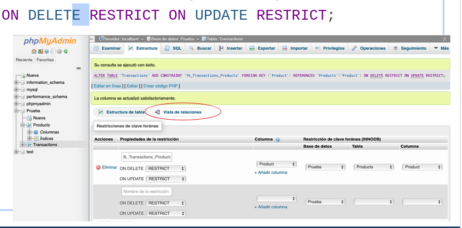

Pensemos en un caso:
Un cliente quiere que desaroolemos un sistema tipo "**Uber**" para Tandil.

El sistema debe permitir (*requerimientos funcionales*):
- Que los ***usuarios*** puedan registrarse.
- Que los usuarios pidan hacer un ***viaje*** de un ***origen*** a un ***destino***.
  
## Modelando los datos:
- Que los usuarios puedan registrarse.

Con qué atributos represento a un usuario en mi sistema?
- nombre
- email
- ciudad

Para distinguir entre usuarios con el mismo nombre, también debemos agregar un ID. Que a su vez, este atributo va a ser nuestra clave primaria, que define una fila única en la tabla.


Como podemos relacionar dichas entidades?

En la tabla viaje vamos a agregar dos nuevos atributos, el `id_usuario` y el `id_conductor`, de esta manera, quedando relacionado por cada viaje, un usuario y un conductor.


## Modelado de Datos - MER:

Es un modelo semantico que describe los requerimientos de datos de un sistema. Elementos del MER:

- Entidad: objeto *real o abstracto* de la vida real del cual se quiere almacenar la información.
- Relación: asociacion entre entidades
- Atributos: caracteristicas que describen las entidades y relaciones


### Claves foraneas

Es un ***atributo o atributos*** que establece un vinculo lógico entre tablas. Por lo general, asocia un campo de una tabla con la clave primaria de otra tabla o tablas. En este caso los atributos `id_conductor` y `id_usuario`.

## Consultas multitablas

Si agregamos una nueva tabla, que aporta informacion sobre el producto de la tabla transaction, hacemos:

```sql
CREATE TABLE `nombreDB`.`Products` ( 
`Product` VARCHAR(45) NOT NULL, 
`Material` VARCHAR(45) NULL, 
`Medium` VARCHAR(45) NULL, 
PRIMARY KEY (`Product`)) ENGINE = InnoDB;
/*Hacemos algunas inserciones*/
INSERT INTO `Products` (`Product`, `Material`, `Medium`) VALUES ('Book', 'Stock Paper', 'Visual’);
INSERT INTO `Products` (`Product`, `Material`, `Medium`) VALUES (‘DVD’, ‘Plastic', ‘Audiovisual’);
INSERT INTO `Products` (`Product`, `Material`, `Medium`) VALUES ('Magazine’, ‘Glossy Paper', 'Visual’);
INSERT INTO `Products` (`Product`, `Material`, `Medium`) VALUES (‘CD’, ‘Plastic', ‘Audio’);
INSERT INTO `Products` (`Product`, `Material`, `Medium`) VALUES (‘Newspaper', ‘Newsprint', 'Visual’);
INSERT INTO `Products` (`Product`, `Material`, `Medium`) VALUES (‘MP3', ‘Digital’, ‘Audio’);

```


## Agregamos una clave foranea

```sql
ALTER TAbLE `Transactions` 
ADD CONSTRAINT `fk_Transactions_Products`
FOREIGN KEY (`Product`)
REFERENCES `Products`(`Product`)
ON DELETE RESTRICT ON UPDATE RESTRICT;
```



### ¿Por qué es necesario agregar una constraint?
- La BD ahora "conoce" la relación entre las tablas
    - Si borramos un registro en la tabla `Product` ahora se chequeara que el registro de esa clave no esté en uso en Transactions
    - Si agregamos un registro de Transactions se vereficará que exista el valor Product en la tabla Product

### Otra opción para definir relaciones


## Consultas multitablas:
- Sql tiene comandos especificos para realizar estas consultas.
    - Que se ven en las clases espeifica de la materia
- Durante la cursada podemos hacer uso de varias consultas "individuales" y "unir" los resultados en PHP.

### Ejemplo simple:
Supongamos que queremos imprimir los datos de una transacción junto al material y al soporte ("medium") del producto comprado.

Estrategia:
1. Hago un `select` de todas las transacciones
2. Por cada transacción
    - imprimo sus datos
    - hago un select de su producto
    - imprimo los datos del producto asociado
### Código PHP:

```php
<?php
    $db = new PDO('mysql:host=localhost'.'dbname=Prueba;charset=utf8', 'root', '');
    $query = $db->prepare('SELECT * FROM Transactions');
    $query->execute();
    $transactions = $query->fetchAll(PDO::FETCH_OBJ);


    echo "<ul>";

    foreach($transactions as $transaction){
        $query = $db->prepare('SELECT * FROM Products WHERE Product = ?');
        $query->execute([$transaction->Product]);
        $product = $query->fetch(PDO::FETCH_OBJ);
        echo '<li>' . $transaction->Channel . ', ' . $transaction->Product . ', ' . $transaction->Price . ', ' . $transaction->Material . ', ' . $transaction->Medium . '</li>';
    }


    echo "</ul>";

?>
```


### Ejemplo con filtro

Supongamos que queremos imprimir los datos de una transaccion pero solo si el material del producto es de un determinado tipo.

<u>Estrategia:</u>

- Hago un select de todas las transacciones
- Por cada transacción
    1. hago un select de su producto
    2. verifico si es del tipo deseado
    3. imprimo sus datos y los datos del producto asociado

### código
```php
    $db = new PDO('mysql:host=localholst;'.'dbname=Prueba;charset=utf8', 'root', '');
    $query = $db->prepare('SELECT * FROM Transactions');
    $query->execute();
    $transactions = $query->fetchAll(PDO::FETCH_OBJ);

    $materialDeseado = "Plastic";

    echo "<ul>";

    foreach($transactions as $transaction){
        $query = $db->prepare('SELECT * FROM Products WHERE Product = ?');
        $query->execute([$transaction->Product]);
    /*Por cada Product de las transactions*/
        $product = $query->fetch(PDO::FETCH_OBJ);
        if(product->Material == $materialDeseado)
            echo '<li>' . $transaction->Channel . ', ' . $transaction->Product 
     	. ', ' . $transaction->Price . ', ' . $product->Material . ', ' . 
     	$product->Medium . '</li>';
        /*Solo se va a imprimir si se cumple la condicion*/
    }
```

### filtro2
Imaginameos que ahora queremos imprimir el promedio de los precios de las transacciones donde el material del producto es de un determinado tipo.

- Hago un select de todas las transacciones
- Por cada transacción 
    1. hago un select de su producto
    1.verifico si es del tipo deseado
    1. sumo el precio de la transacción a una variable
    (Es decir, que se cumpla la condicion del material del proucto)
- Divido la suma por la cantidad de transacciones que cumplian con lo pedido

```php
<?php
  $db = new PDO('mysql:host=localhost;'.'dbname=Prueba;charset=utf8', 'root', '');
  $query = $db->prepare('SELECT * FROM Transactions');
  $query->execute();
  $transactions = $query->fetchAll(PDO::FETCH_OBJ);

  $materialDeseado = "Plastic";
  $accum = 0;    
  $cant = 0;

  foreach($transactions as $transaction){
     $query = $db->prepare('SELECT * FROM Products WHERE Product = ?');
     $query->execute([$transaction->Product]);
     $product = $query->fetch(PDO::FETCH_OBJ);
	if($product->Material == $materialDeseado){
     	$accum = $accum + $transaction->Price;          
$cant++;
}
  }
  echo '<h1> El promedio es ' . $accum/$cant . '</h1>';


```

## Consulta multitablas en SQL
La operacion `JOIN` nos permite acceder a más de una tabla al mismo tiempo. Hay diferentes tipos de JOIN que se pueden aplicar dependiendo del tipo de resultado que esperamos obtener.


Si queremos ver datos de dos tablas, la sintaxis se ve así:

```sql
SELECT a.FIELD_1, ..., a.FIELD_N, b.FIELD_1, ..., b.FIELD_N
FROM TABLE_1 a
INNER JOIN TABLE_2 b
ON a.KEY = b.KEY
```

Supongamos que queremos tener más información de los productos que se compraron:

```sql
SELECT a.*, b.*
FROM Transactions a
INNER JOIN Products b
ON a.PRODUCT = b.PRODUCT
```


Imprimir los datos de una transaccion pero sólo si el material del producto es del tipo "Plastic".


Tenemos dos tablas, una de transacciones y otra con informacion del producto. Los datos que queremos mostrar estan repartidos entre ambas, por lo que debemos unirlas.

```sql
SELECT a.* FROM Transactions a
INNER JOIN Products b ON a.PRODUCT = b.PRODUCT
WHERE b.Material = 'Plastic'
```

tanto `a` como `b` son "Alias" para las tablas, cuando decimos a.* -> quiere decir `Transactions.*`. ON quiere decir que se fije en que tanto el valor de a.Product sea igual a b.Product. Y por último damos la condicional de que queremos que  `b(PRODUCTS).Product == 'Plastic'`.


Queda lo de operadores logicos, a partir de la pagina 37.