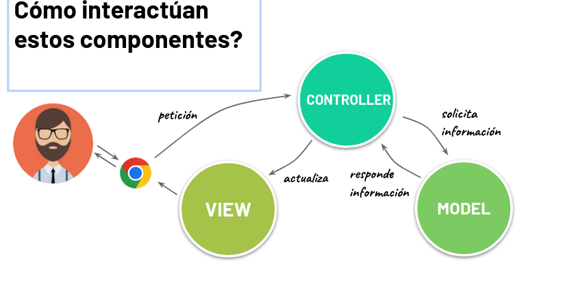
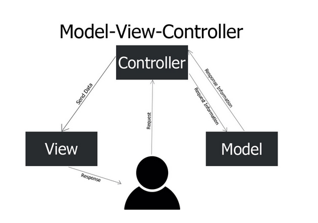
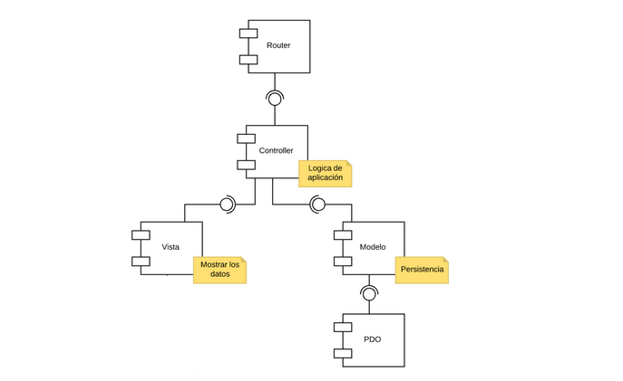
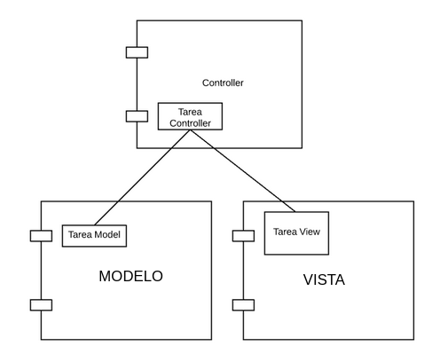

# MVC

## ¿Qué problemas resuelve?

**Desacopla el código** de programas dónde toda la *lógica*, el *acceso a datos* y la *interfáz gráfica* bajo mismos archivos sin ningun tipo de *separación clara*.

## ¿Qué propone MVC?

Divide la lógica en ***tres elementos interrelacionados***.

- **Modelo**: acceso a los datos.
  - Protege y persiste los datos del usuario.
  - Asegura la integridad de los datos.
  - Provee métodos para insertar, consultar, actualizar y eliminar los datos (CRUD).
- **Vista**: Interfaz gráfica (front-end).
  - Presenta la información al usuario.
  - Permite al usuario **interactuar con la aplicación**.
- **Controlador**: Coordinar entre vista y modelos.
  - Controla y coordina el flujo de la aplicación.
  - Procesa las solicitudes del usuario.
  - Valida la entrada de datos del usuario.

## ¿Como interactuan estos componentes?




## Ejemplo refactor:

Nuestra lista de tareas va a se reefactorizada para que use el MVC. Usaremos una solucion orientada a objetos.

- Cada **código** que teníamos en las **páginas principales** es un método *Controller*.
- Los agrupamos por significado en clases.

## Objetos:

### TareasView

- Renderiza la lista de tareas.
- Reenderiza una sóla tarea,

### TareasModel
- Administra las tareas en la base de datos.

### TareasController
- Atiende las acciones del usuario.

## Paso a paso - 3 iteraciones:

- Ver tareas
- Crear tareas
- Eliminar tareas.

En la **vista** vamos a tener:
>  Html + php
>  - Titulo
>  - Formulario
>   - Lista de tareas
> 
>   ¿Cual es la entrada de datos que necesitamos en esta vista para renderizarse?

```php
    function verTareas($tareas){
        ...
    }
``` 

En el **modelo** vamos a tener:

> Consulta a la BDD
> 
> Php + PDO:
> 
> - Método que devuelva la lista de tareas:

```php
    function getTareas(){
        ...
    }
```

En el **controlador** vamos a tener:
> 1. *Pide* al modelo *las tareas*.
> 2. *Se las da a la vista* para que las muestre.

- `controller/task_controller.php`:
```php
    <?php
    require_once("models/task.model.php");
    require_once("views/task.view.php");
   /*Necesitamos llamar a los métodos de ambos archivos*/
   
    class TaskController{

    }

    ?>
```

### ¿Cómo queda la arquitectua?



### MVC
Cada componente está hecho de clases.

En este ejemplo tienen una sola, pero puede haber más.




## 2da iteracion

¿Qué vamos a tener en la **vista**?
- Formulario con botón para ***crear*** la tarea.

## 3ra iteracion 

## ¿Cuantas clases vamos a tener?

### MVC
no propone ninguna regla para esto, pero sí existen ciertos estándares que podemos seguir:

- **Modelo**:
  - Por lo general, ***una clase (model) por entidad***.
  - Ej. Una clase para tareas, otra para Usuarios.
- **Vista**:
  - Una clase por ***entidad a mostrar***
  - Ej. una clase para mostrar lo relacionado a Tareas (lista, detalles, formularios).
- **Controlador**:
  - Una clase por cada ***lógica*** a controlar.
  - Ejemplo: una clase para CRUD de `tareas`.