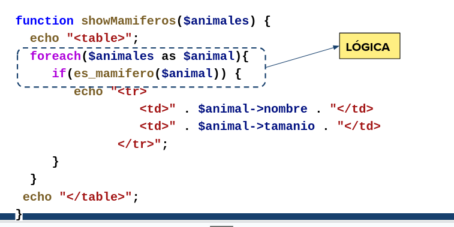
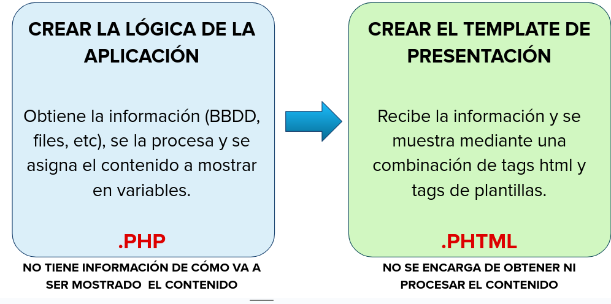
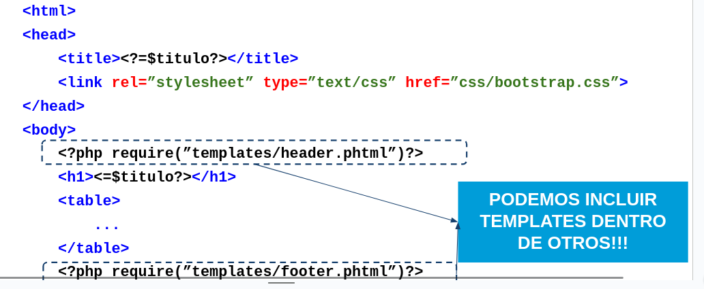
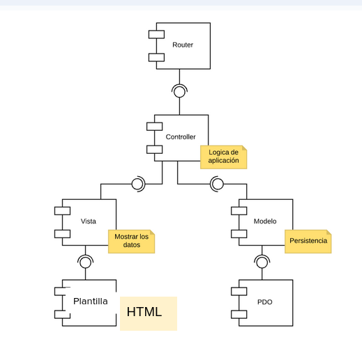
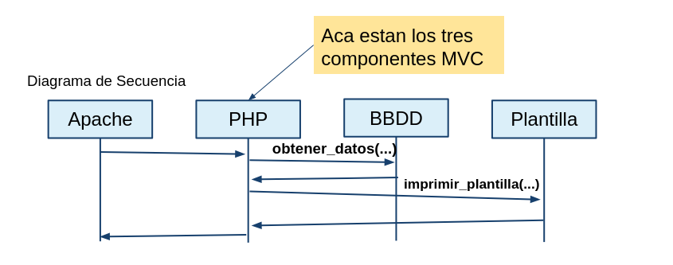
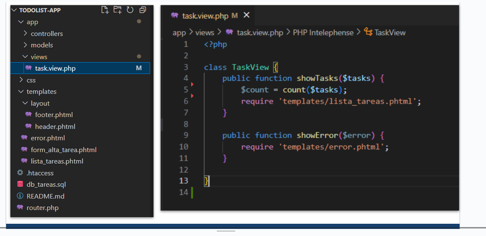
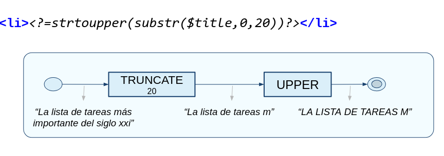

# Templates

### Plantillas

Las plantillas son archivos que se utilizan para separar la **lógica del programa** y la **presentacion del contenido** en dos partes independientes.

#### Ventajas:
- Facilita el desarrollo tanto de la lógica como de la presentacion.
- Facilita la modificacion y el matenimiento.

Son importantes porque separan la lógica de la presentacion. 

### Lógica:
La **lógica de una aplicación** es la parte del código que realiza todo lo referido a la obtencion, almacenamiento y procesamiento de los datos para entregarlos a una **vista** que sabe como visualizarlos. Se dice que el "detras de escena" necesario para poder presentar los datos en pantalla.

### Problema #1

Supongamos el siguiente código dónde mezclamos html y php, ¿qué parte es la lógica y cual la vista?



## <?=$phtml>

### phtml
- **.phtml** es una de las extensiones ***aceptadas*** para php.
- nacio para php2
- Apache lo interpreta de la misma manera que interpreta php.
- Nos permite diferenciar archivos de templates de forma sencilla.

### php con html VS. html con php

Usamos una *combinación* de etiquetas HTML y **etiquetas de plantilla** para formatear la presentación del contenido.

**Etiquetas de plantilla** -> Usan el formato `<?=$var?>`.

La idea siempre es:

- Mantener *separada* la presentación (mennor acomplamiento posible)
- Mismo objetivo que CSS (separado del html).
- El menor overhead posible.

### Usar plantillas:



### Resolucion problema #1 con plantillas:

```php
<?php
    function showMamiferos($animales){
        $mamiferos = array();//arreglo para guardar sólo a los mamiferos


        foreach($animales as $animal){
            if(es_mamifero($animal))
                array_push($mamiferos, $animal);
        }

        //Asignamos las variables para mostrar
        $titulo = "Lista de mamiferos";
        $animales = $mamiferos;

        require('template/animales.phtml');//muestro el template
    }
?>
```

### template:

```php
    <h1><?=$titulo?></h1>

    <table>
        <?php foreach($animales as $animal): ?>
            <tr>
                <td><?=$animal->nombre?></td>
                <td><?=$animal->peso?></td>
                <td><?=$animal->tamanio?></td>
            </tr>
        <?php endforeach; ?>
        
    </table>
```

### Plantilla include


### Características:
Los templates se enfocan en tener:
- Plantillas rápidas
- Poco código
- Mantenibles

PHP nos ofrece [*alternativas a las estructuras de control*](https://www.php.net/manual/en/control-structures.alternative-syntax.php) para mejorar la visibilidad en plantillas



### ejecución

- Accedemos a la página `animales.php`
  - PHP ejecuta la lógica de negocio y de plantilla.
  - La plantilla se encarga de plasmar los datos.



## Code
- lo voy a hacer en la carpeta de web 2.

### listar_tareas.phtml

```php
    <?php require 'templates/layout/header.phtml'?>
    <?php require 'templates/layout/form_alta_tarea.phtml'?>

    <ul class="list-group">
        <?php foreach($task as $task):?>
            <li class="list-group-item item-task <?php if($task->finalizada):?> finished> <?php endif ?>"
            <div class="actions">
                <?php if(!$task->$finalizada):?>
                    <a href="finalizar/<?= $task->id?>" type="button" class="btn btn-succes btn-sm ml-auto">Finalizar</a>
                <?php endif ?>
                <a href="eliminar/<?php $task->id?>" type="button" class="btn btn-danger btn-sm ml-auto"> Borrar</a>
            </div>

            </li>

        <?php endforeach; ?>
    </ul>
 // ...
```



> esto seria el componente "*vista*" llamando al template para mostrar a las tareas.

### Modificadores
> Ahora queremos que los títulos o descripción se vean en mayúsculas y solo se muestren los primeros 20 caracteres.

>Las modificaciones que no hacen a la lógica de negocio, sino al aspecto de nuestro sitio, las realizamos en la plantilla:


### Extra alternativas estructuras

```php
# if
<?php if ($a == 5): ?>
A is equal to 5
<?php endif; ?>


```

```php
#ifelse complejo

<?php
if ($a == 5):
    echo "a equals 5";
    echo "...";
elseif ($a == 6):
    echo "a equals 6";
    echo "!!!";
else:
    echo "a is neither 5 nor 6";
endif;

```
```php


```
```php


```